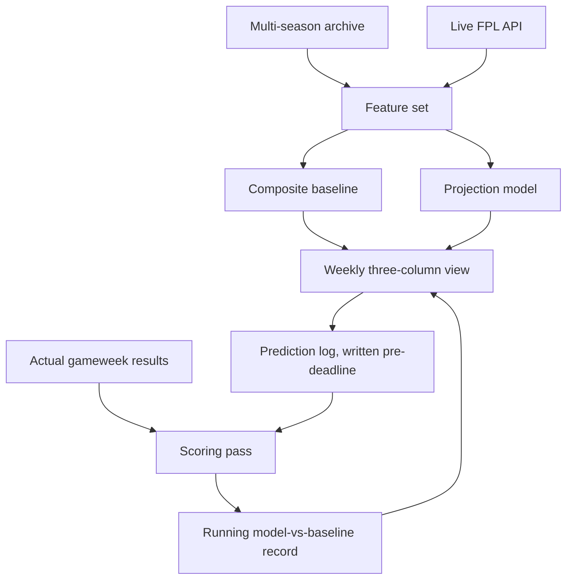

# FPL Decision Engine - Plan

## Goal Capsule

- **Objective:** Each gameweek, the manager can see how their own squad, a projection model, and a transparent baseline each rate their available moves, and can tell over time whether the model is actually adding anything.
- **Product authority:** Single-user private tool. Chip timing, multi-user access, and mini-league features are not active scope.
- **Open blockers:** None blocking planning. Two items in Outstanding Questions are marked `Resolve Before Planning`.

---

## Product Contract

### Summary

A private, single-user Fantasy Premier League app that projects per-player points from multi-season history and presents each gameweek as a three-column comparison: the model's picks, a composite baseline's picks, and the current squad. It records its predictions before results are known and scores them afterwards, so evaluation continues past the initial backtest.

### Problem Frame

Weekly FPL decisions — which transfer, who to captain — are currently made on feel: recent form, fixture eyeballing, and whatever the consensus is that week. That is workable but unexamined, and there is no way to tell afterwards whether a given call was good process or a good result.

The obvious remedy, a points model, has a specific failure mode. A homegrown projection is easy to build and hard to trust: it produces a confident-looking number, the author chose its features and its evaluation window, and a single historical backtest run by the person who built the model is weak evidence. The risk is not that the model is wrong; it is that it is wrong in a way that is invisible, gets acted on for a season, and quietly costs rank.

Two structural constraints shape any answer. The official Fantasy Premier League API serves detailed data for the current season only — past seasons appear as season totals, not gameweek rows — so multi-season history has to come from a community archive with its own coverage gaps. And player identifiers are reassigned between seasons, so a player's history does not stitch together without explicit mapping work.

### Key Decisions

- KD1. **The comparison baseline is a composite, not a naive rule.** (session-settled: user-directed — chosen over season-to-date points-per-game, last-5 form, and crowd ownership: a bar the model can clear by accident proves nothing.) Governs R7, R8.
- KD2. **The weekly view presents three columns rather than a single recommendation.** (session-settled: user-directed — chosen over an optimiser and a squad diagnostic: trust in the model is the bottleneck, so the surface that keeps earning it beats the surface that assumes it.) Governs R11, R12.
- KD3. **The app is its own ongoing evaluation harness.** Predictions are written before results are known, which produces out-of-sample evidence a historical backtest cannot. Governs R14, R15.
- KD4. **A failed backtest does not stop the product.** (session-settled: user-directed — chosen over stopping the build and over iterating until the gate passes: the view has standalone value driven by the baseline alone.) Governs R9.
- KD5. **Chip timing stays out.** (session-settled: user-approved — chip decisions are season-level and already handled by hand, and folding them in roughly doubles the modelling surface for the part least likely to change behaviour.)
- KD6. **Single-user, no accounts.** (session-settled: user-directed — chosen over a public tool under the Nat Does The Math brand: removes auth and per-user state, and allows an unpolished surface.) Governs R10.
- KD7. **The projection logic is a pure library, callable without a UI.** The same functions must run over historical gameweeks for the backtest and over the current gameweek for the view; a model reachable only through the app cannot be evaluated. Governs R6, R7.

The loop the product runs on:

### Requirements

**Data foundation**

- R1. The system ingests per-gameweek historical player data across multiple past seasons from a community archive.
- R2. The system resolves player identity across seasons so that one player's history is retrievable as a single series despite per-season identifier reassignment.
- R3. The system records, per season ingested, which statistical fields are available, so downstream logic can tell a genuine zero from an absent field.
- R4. The system fetches current-season data — squad, prices, fixtures, gameweek results — from the live Fantasy Premier League API.
- R5. A player with no prior Premier League history is represented explicitly as cold-start rather than as a low projection.

**Projection and baseline**

- R6. The projection logic is callable as a library over any historical gameweek without invoking the user interface.
- R7. The composite baseline projects a player's points from historical scoring average, the ICT influence measure, and recent form, using no fixture or minutes-risk input.
- R8. The projection model projects a player's points from the baseline's inputs plus fixture difficulty and minutes risk.
- R9. Both the baseline and the model remain available to the weekly view regardless of backtest outcome.

**Weekly view**

- R10. The manager's team identifier is supplied as configuration, and the app fetches that squad without a login.
- R11. The weekly view presents three parallel columns for the upcoming gameweek: the model's preferred moves, the baseline's preferred moves, and the current squad's projected outcome.
- R12. Within each column, the view ranks the fifteen squad players against the best available alternative at a comparable price and surfaces the largest projected gaps.
- R13. The view flags minutes risk on any recommended player.

**Evaluation**

- R14. The app records each gameweek's model projections and baseline projections before that gameweek's deadline.
- R15. Once a gameweek's results are final, the app scores the stored projections against actual points and updates a running model-versus-baseline record.
- R16. The backtest replays past seasons gameweek by gameweek and reports the model's and baseline's squad-level outcomes over the same period.
- R17. The backtest excludes from a gameweek's inputs any data that was not knowable before that gameweek's deadline.

### Key Flows

- F1. Weekly decision
  - **Trigger:** Manager opens the app in the days before a gameweek deadline.
  - **Steps:** App fetches the current squad and player pool; baseline and model each project the upcoming gameweek; the view renders three columns with gap rankings and minutes-risk flags; manager makes their own transfer and captain calls.
  - **Outcome:** Manager has acted, and the gameweek's projections are stored.
  - **Covered by:** R4, R10, R11, R12, R13, R14

- F2. Post-gameweek scoring
  - **Trigger:** A gameweek's results become final.
  - **Steps:** App retrieves actual points; scores the stored model and baseline projections; updates the running record.
  - **Outcome:** The running model-versus-baseline record reflects one more out-of-sample gameweek.
  - **Covered by:** R15

- F3. Historical backtest
  - **Trigger:** Manager runs the backtest, typically after changing model features.
  - **Steps:** The projection library replays past seasons gameweek by gameweek under a knowable-at-the-time input restriction; squad-level outcomes are computed for model and baseline over the same period.
  - **Outcome:** A report stating whether the model beat the baseline, and by how much.
  - **Covered by:** R6, R16, R17

### Acceptance Examples

- AE1. Cold-start player
  - **Covers R5.**
  - **Given** a player promoted into the Premier League this season with no prior top-flight record,
  - **When** the weekly view renders,
  - **Then** the player appears marked as having no history rather than carrying a projection built from absent data.

- AE2. Backtest leakage guard
  - **Covers R17.**
  - **Given** the backtest is replaying gameweek 12 of a past season,
  - **When** the model projects players for that gameweek,
  - **Then** no input derived from gameweek 12 or later is available to it.

- AE3. Model loses the gate
  - **Covers R9.**
  - **Given** the backtest reports that the model did not beat the composite baseline,
  - **When** the manager opens the weekly view,
  - **Then** all three columns still render and the baseline column remains usable on its own.

- AE4. Prediction recorded before deadline
  - **Covers R14.**
  - **Given** a gameweek deadline has passed with the app never opened that week,
  - **When** the scoring pass runs,
  - **Then** that gameweek is recorded as having no stored prediction rather than being scored from a projection generated after the fact.

### Success Criteria

- The backtest reports a squad-level comparison between model and baseline over the same historical period, with the same input restriction applied to both.
- The running out-of-sample record is readable at a glance from the weekly view.
- The weekly view is usable in under five minutes before a deadline.

### Scope Boundaries

**Deferred for later**

- Chip timing recommendations — Wildcard, Bench Boost, Triple Captain, Free Hit.
- Automated transfer execution against the FPL account.
- Price-change prediction.

**Outside this product's identity**

- Multi-user access, accounts, or any public deployment under the Nat Does The Math brand.
- Mini-league or rival-tracking features.
- A polished consumer interface; the surface only needs to serve one reader.

### Dependencies and Assumptions

- The `vaastav/Fantasy-Premier-League` community archive is the multi-season source. It is MIT-licensed, covers roughly 2016-17 onwards, and carries per-season coverage flags because older seasons predate expected-goals data.
- The public Fantasy Premier League API is available without authentication for squad, fixture, price, and results data. It has no published stability guarantee; an endpoint change breaks weekly ingestion.
- Transfers are judged over a rolling multi-gameweek window and captaincy over the single upcoming gameweek. This is an assumption, not a stated requirement — see Outstanding Questions.
- Fixture difficulty and minutes risk may not add enough signal over the composite baseline to change decisions. The plan treats this as a likely outcome, not an edge case.

### Outstanding Questions

**Resolve Before Planning**

- The rolling window length for transfer evaluation. The choice materially changes what the view recommends: a short window churns transfers, a long one under-reacts to form.
- What "beating the baseline" means numerically — the margin and the historical period over which it must hold. Without a stated threshold the gate cannot be adjudicated.

**Deferred to Planning**

- Where the prediction log is stored and in what form.
- How fixture difficulty is represented, beyond it being an input the baseline lacks.
- How minutes risk is derived.
- Whether the backtest reports one aggregate figure or a per-season breakdown.

### Sources and Research

- `vaastav/Fantasy-Premier-League` — per-season folders with gameweek-level player stats, merged gameweek files, and per-player histories; the multi-season source for R1 and the coverage flags in R3.
- The official Fantasy Premier League API — bootstrap, element-summary, fixtures, and entry endpoints; current-season detail only, with past seasons available as totals rather than gameweek rows.
- The `engine/` and `app/` separation already used in the football-idle project is a directly applicable shape for KD7, where projection logic must run headless.
