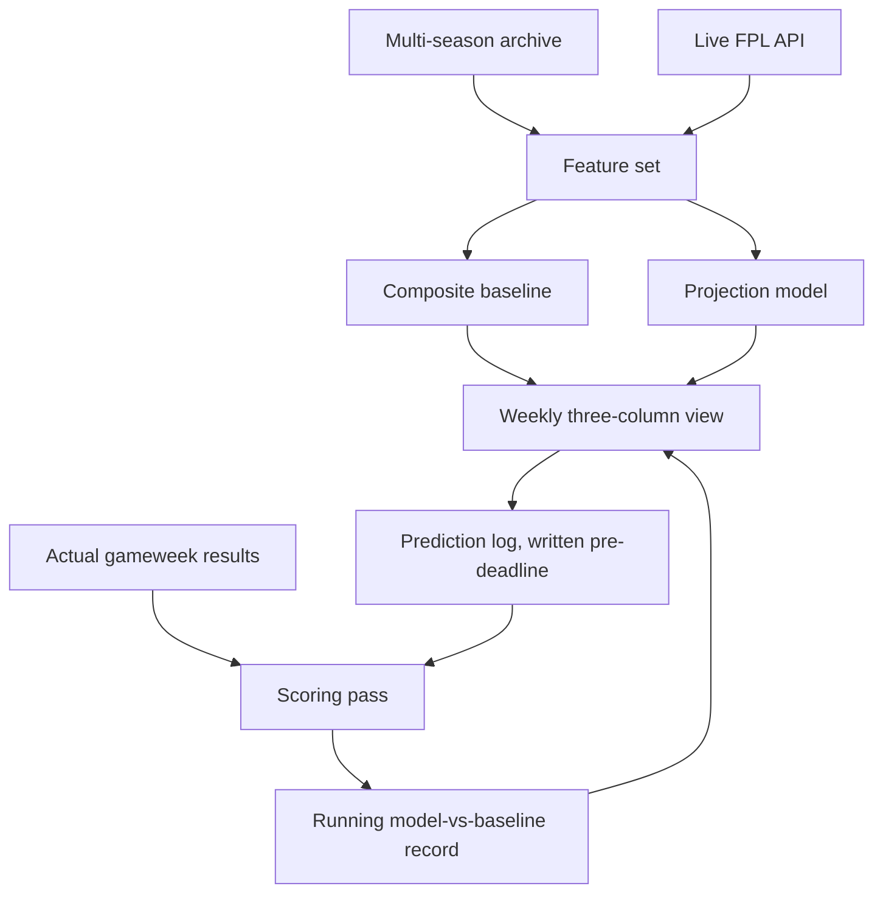
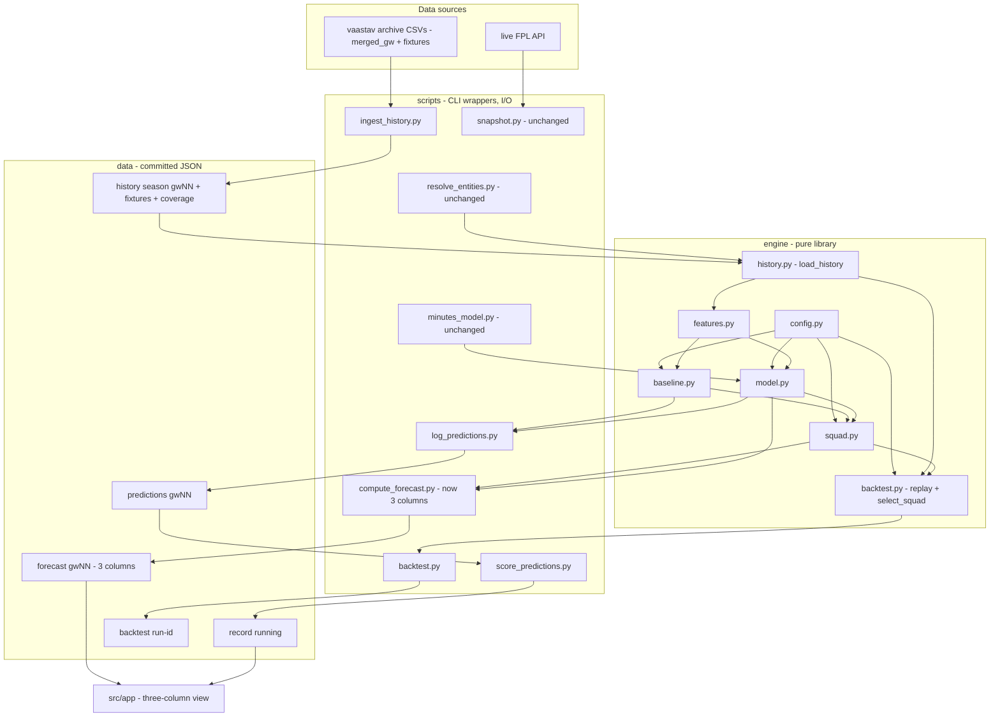
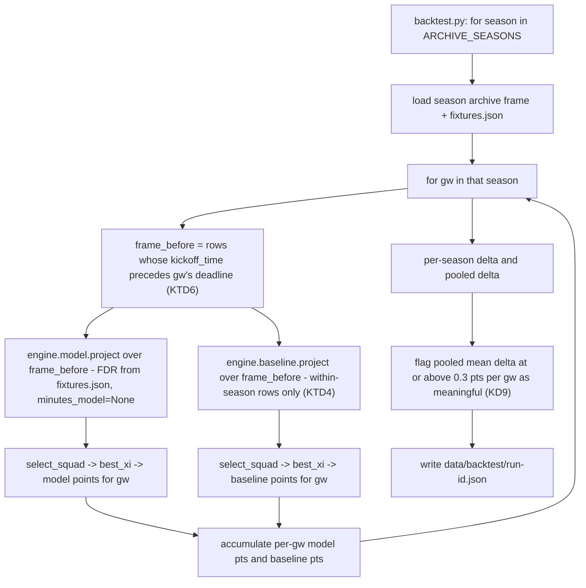

# FPL Decision Engine - Plan

## Goal Capsule

- **Objective:** Each gameweek, the manager can see how their own squad, a projection model, and a transparent baseline each rate their available moves, and can tell over time whether the model is actually adding anything.
- **Means:** Extract the projection math into a headless `engine/` library, add a composite baseline beside the model, replace the single best-XI recommendation with a three-column view, and add a pre-deadline prediction log, a post-gameweek scoring pass, and a leakage-guarded backtest (KTD1, KTD6).
- **Product authority:** Single-user private tool. Chip timing, multi-user access, and mini-league features are not active scope.
- **Open blockers:** None. The two `Resolve Before Planning` questions are settled as KD8 (transfer window) and KD9 (baseline threshold).
- **Execution profile:** Deep. Three surfaces move together — a Python library plus CLI wrappers, the daily GitHub Action, and the static Next.js app. New `engine/` modules are built test-first; the reused scripts get characterization coverage only where the extraction changes their call path.
- **Tail ownership:** Implementation lands as dependency-ordered commits straight on the default branch (`claude/fpl-forecaster-build-setup-ksd7z0`), no PR, per the delivery decision for this planning pass. Repo conventions and user preference override that at execution time.

---

## Product Contract

**Product Contract preservation:** restructured, no scope change. R1–R17, F1–F3, AE1–AE4, and KD1–KD7 are unchanged. The two `Resolve Before Planning` questions are resolved as new Key Decisions KD8 and KD9. The `Deferred to Planning` questions are answered in the Planning Contract (KTD2, KTD10, KTD9, and the backtest-output shape in U11).

### Summary

A private, single-user Fantasy Premier League app that projects per-player points from multi-season history and presents each gameweek as a three-column comparison: the model's picks, a composite baseline's picks, and the current squad. It records its predictions before results are known and scores them afterwards, so evaluation continues past the initial backtest.

### Problem Frame

Weekly FPL decisions — which transfer, who to captain — are currently made on feel: recent form, fixture eyeballing, and whatever the consensus is that week. That is workable but unexamined, and there is no way to tell afterwards whether a given call was good process or a good result.

The obvious remedy, a points model, has a specific failure mode. A homegrown projection is easy to build and hard to trust: it produces a confident-looking number, the author chose its features and its evaluation window, and a single historical backtest run by the person who built the model is weak evidence. The risk is not that the model is wrong; it is that it is wrong in a way that is invisible, gets acted on for a season, and quietly costs rank.

Two structural constraints shape any answer. The official Fantasy Premier League API serves detailed data for the current season only — past seasons appear as season totals, not gameweek rows — so multi-season history has to come from a community archive with its own coverage gaps. And player identifiers are reassigned between seasons, so a player's history does not stitch together without explicit mapping work.

### Key Decisions

- KD1. **The comparison baseline is a composite, not a naive rule.** (session-settled: user-directed — chosen over season-to-date points-per-game, last-5 form, and crowd ownership: a bar the model can clear by accident proves nothing.) Governs R7, R8.
- KD2. **The weekly view presents three columns rather than a single recommendation.** (session-settled: user-directed — chosen over an optimiser and a squad diagnostic: trust in the model is the bottleneck, so the surface that keeps earning it beats the surface that assumes it.) Governs R11, R12.
- KD3. **The app is its own ongoing evaluation harness.** Predictions are written before results are known, which produces out-of-sample evidence a historical backtest cannot. Governs R14, R15.
- KD4. **A failed backtest does not stop the product.** (session-settled: user-directed — chosen over stopping the build and over iterating until the gate passes: the view has standalone value driven by the baseline alone.) Governs R9.
- KD5. **Chip timing stays out.** (session-settled: user-approved — chip decisions are season-level and already handled by hand, and folding them in roughly doubles the modelling surface for the part least likely to change behaviour.)
- KD6. **Single-user, no accounts.** (session-settled: user-directed — chosen over a public tool under the Nat Does The Math brand: removes auth and per-user state, and allows an unpolished surface.) Governs R10.
- KD7. **The projection logic is a pure library, callable without a UI.** The same functions must run over historical gameweeks for the backtest and over the current gameweek for the view; a model reachable only through the app cannot be evaluated. Governs R6, R7.
- KD8. **Transfers are judged over a rolling 5-gameweek window; captaincy over the single upcoming gameweek.** (session-settled: user-directed — chosen over 3 gameweeks, a next-fixture-block window, and a single-gameweek window: 5 matches the horizon most managers plan on and the constant already in the scaffold.) Governs R12.
- KD9. **"Beating the baseline" is reported, not gated.** The backtest reports the model-versus-baseline squad points delta per season and pooled, and flags a pooled mean difference of 0.3 points per gameweek per squad or more as meaningful. It never blocks the build. In the backtest `engine.baseline` is held to the same within-season restriction as the live path (KTD4), so the reported delta is measured against the baseline that actually ships. (session-settled: user-directed — chosen over a majority-of-seasons rule, a strict 5%-over-two-seasons rule, and no numeric threshold: KD4 already makes the gate informational, so a stated number just makes the report legible.) Governs R16; supports the first Success Criterion.

The loop the product runs on:



### Requirements

**Data foundation**

- R1. The system ingests per-gameweek historical player data across multiple past seasons from a community archive.
- R2. The system resolves player identity across seasons so that one player's history is retrievable as a single series despite per-season identifier reassignment.
- R3. The system records, per season ingested, which statistical fields are available, so downstream logic can tell a genuine zero from an absent field.
- R4. The system fetches current-season data — squad, prices, fixtures, gameweek results — from the live Fantasy Premier League API.
- R5. A player with no prior Premier League history is represented explicitly as cold-start rather than as a low projection.

**Projection and baseline**

- R6. The projection logic is callable as a library over any historical gameweek without invoking the user interface.
- R7. The composite baseline projects a player's points from historical scoring average, the ICT influence measure, and recent form, using no fixture or minutes-risk input.
- R8. The projection model projects a player's points from the baseline's inputs plus fixture difficulty and minutes risk.
- R9. Both the baseline and the model remain available to the weekly view regardless of backtest outcome.

**Weekly view**

- R10. The manager's team identifier is supplied as configuration, and the app fetches that squad without a login.
- R11. The weekly view presents three parallel columns for the upcoming gameweek: the model's preferred moves, the baseline's preferred moves, and the current squad's projected outcome.
- R12. Within each column, the view ranks the fifteen squad players against the best available alternative at a comparable price and surfaces the largest projected gaps.
- R13. The view flags minutes risk on any recommended player.

**Evaluation**

- R14. The app records each gameweek's model projections and baseline projections before that gameweek's deadline.
- R15. Once a gameweek's results are final, the app scores the stored projections against actual points and updates a running model-versus-baseline record.
- R16. The backtest replays past seasons gameweek by gameweek and reports the model's and baseline's squad-level outcomes over the same period.
- R17. The backtest excludes from a gameweek's inputs any data that was not knowable before that gameweek's deadline.

### Key Flows

- F1. Weekly decision
  - **Trigger:** Manager opens the app in the days before a gameweek deadline.
  - **Steps:** App fetches the current squad and player pool; baseline and model each project the upcoming gameweek; the view renders three columns with gap rankings and minutes-risk flags; manager makes their own transfer and captain calls.
  - **Outcome:** Manager has acted, and the gameweek's projections are stored.
  - **Covered by:** R4, R10, R11, R12, R13, R14

- F2. Post-gameweek scoring
  - **Trigger:** A gameweek's results become final.
  - **Steps:** App retrieves actual points; scores the stored model and baseline projections; updates the running record.
  - **Outcome:** The running model-versus-baseline record reflects one more out-of-sample gameweek.
  - **Covered by:** R15

- F3. Historical backtest
  - **Trigger:** Manager runs the backtest, typically after changing model features.
  - **Steps:** The projection library replays past seasons gameweek by gameweek under a knowable-at-the-time input restriction; squad-level outcomes are computed for model and baseline over the same period.
  - **Outcome:** A report stating whether the model beat the baseline, and by how much.
  - **Covered by:** R6, R16, R17

### Acceptance Examples

- AE1. Cold-start player
  - **Covers R5.**
  - **Given** a player promoted into the Premier League this season with no prior top-flight record,
  - **When** the weekly view renders,
  - **Then** the player appears marked as having no history rather than carrying a projection built from absent data.

- AE2. Backtest leakage guard
  - **Covers R17.**
  - **Given** the backtest is replaying gameweek 12 of a past season,
  - **When** the model projects players for that gameweek,
  - **Then** no input from a match that kicked off at or after gameweek 12's deadline is available to it.

- AE3. Model loses the gate
  - **Covers R9.**
  - **Given** the backtest reports that the model did not beat the composite baseline,
  - **When** the manager opens the weekly view,
  - **Then** all three columns still render and the baseline column remains usable on its own.

- AE4. Prediction recorded before deadline
  - **Covers R14.**
  - **Given** a gameweek deadline has passed with the app never opened that week,
  - **When** the scoring pass runs,
  - **Then** that gameweek is recorded as having no stored prediction rather than being scored from a projection generated after the fact.

### Success Criteria

- The backtest reports a squad-level comparison between model and baseline over the same historical period, with the same input restriction applied to both.
- The running out-of-sample record is readable at a glance from the weekly view.
- The weekly view is usable in under five minutes before a deadline.

### Scope Boundaries

**Deferred for later**

- Chip timing recommendations — Wildcard, Bench Boost, Triple Captain, Free Hit.
- Automated transfer execution against the FPL account.
- Price-change prediction.

**Outside this product's identity**

- Multi-user access, accounts, or any public deployment under the Nat Does The Math brand.
- Mini-league or rival-tracking features.
- A polished consumer interface; the surface only needs to serve one reader.

**Deferred to Follow-Up Work**

- The expected-goals team-strength (λ) model that the scaffold comments call for. FDR stays the interim opponent-difficulty signal (KTD10).
- Wiring the *live* composite baseline to the multi-season archive. The archive lands with the backtest in this plan; the live baseline stays within-season (KTD4).
- Budget and selling-price validation for transfer overrides, and for the backtest's squad construction. The README names this the largest silent-corruption surface in the project; it stays deferred rather than done wrong (KTD12).
- Evaluating minutes risk inside the backtest. The backtest model runs without the minutes term (KTD6); minutes risk is evaluated only in the live out-of-sample record.
- Per-season backtest tuning of baseline component weights beyond a single documented default.

### Dependencies and Assumptions

- The `vaastav/Fantasy-Premier-League` community archive is the multi-season source. It is MIT-licensed, covers roughly 2016-17 onwards, and carries per-season coverage flags because older seasons predate expected-goals data.
- The public Fantasy Premier League API is available without authentication for squad, fixture, price, and results data. It has no published stability guarantee; an endpoint change breaks weekly ingestion.
- Transfers are judged over a rolling 5-gameweek window and captaincy over the single upcoming gameweek (KD8).
- Fixture difficulty and minutes risk may not add enough signal over the composite baseline to change decisions. The plan treats this as a likely outcome, not an edge case.
- The backtest covers the last three completed seasons (2025-26, 2024-25, 2023-24), matching the seasons `scripts/resolve_entities.py` already resolves (KTD3).

### Outstanding Questions

Both `Resolve Before Planning` questions are settled (KD8, KD9). The remaining `Deferred to Planning` items are answered in the Planning Contract: prediction-log storage (KTD2), how fixture difficulty is represented (KTD10), how minutes risk is derived (KTD9), and the backtest report shape (U11 — per-season plus pooled). No launch-blocking question remains. Non-blocking implementation-time questions are gathered under `## Open Questions` below.

One known unknown carries into implementation, not blocking: the 2026/27 chip allocation is assumed from the 2025/26 ruleset in `src/lib/snapshots.ts` and is not re-verified against live `bootstrap-static`. It affects a display string only and is out of active scope.

### Sources and Research

- `vaastav/Fantasy-Premier-League` — per-season `gws/merged_gw.csv` (gameweek-level player rows, including the `element` id and `kickoff_time`), `fixtures.csv` (per-fixture `team_h_difficulty` / `team_a_difficulty`), `players_raw.csv` (season totals and the `starts` field), and `player_idlist.csv` (per-season id list). The multi-season source for R1 and the coverage flags in R3.
- The official Fantasy Premier League API — `bootstrap-static` (the `events` array carries `deadline_time`, `finished`, `data_checked`), `element-summary`, `fixtures`, `event/{gw}/live`, and `entry/{id}` endpoints; current-season detail only, with past seasons available as totals rather than gameweek rows.
- `scripts/compute_forecast.py` — the current projection assembly (`load_minutes_model`, `team_fixture_multiplier`, `availability_multiplier`, `best_xi`). This is the code that U1 extracts into `engine/` to satisfy KD7 and R6.
- `scripts/minutes_model.py` — empirical-Bayes minutes model. Its `pStart` / `pCameo` / `pUnused` buckets feed the minutes-risk flag (R13, KTD9); its `expectedMinutes` feeds the model's minutes-risk input (R8).
- `scripts/resolve_entities.py` — the cross-season id map for R2. Its `PAST_SEASONS` constant fixes the archive depth (KTD3). Its `unresolved` list and row-count assertion are the pattern for never silently guessing a join.
- `scripts/snapshot.py` — the dated / gameweek-keyed JSON archive pattern under `data/`. `data/history/`, `data/predictions/`, and `data/record/` mirror it (KTD2). Finished gameweeks are keyed `gwNN.json` and never rewritten; `score_predictions.py` therefore fetches `event/{gw}/live` fresh rather than trusting a frozen snapshot (KTD7).
- `src/lib/snapshots.ts` and `src/app/page.tsx` — the static `data/` reader and the current single-recommendation UI that U8 and U13 replace with the three-column view (R11).
- `.github/workflows/snapshot.yml` — the daily pipeline order that U12 extends.

---

## Planning Contract

### Approach

The Product Contract is the target; the scaffold is the starting point. The snapshotter, entity resolution, and minutes model are reused unchanged. Four things move:

1. **Projection logic becomes a library.** `scripts/compute_forecast.py` today mixes file loading, projection math, and `best_xi` selection in one `main()`. U1 lifts the math into an importable `engine/` package of pure functions; `scripts/compute_forecast.py` stays as a thin CLI wrapper that loads JSON, calls `engine`, and writes JSON. Every later unit builds on `engine/`.
2. **Packaging.** A minimal `pyproject.toml` declares `engine` as an installable package so `python scripts/foo.py` can `import engine.*`; the Action and local-dev docs run `pip install -e .` after `pip install -r requirements.txt` (U2, U12).
3. **The model gains a sibling and an evaluation harness.** `engine/baseline.py` and `engine/model.py` are two projection functions over a shared feature frame. `engine/squad.py` ranks a squad against the pool over the 5-gameweek window. `scripts/log_predictions.py` and `scripts/score_predictions.py` write and then score a per-gameweek prediction log. `engine/backtest.py` replays archived seasons with a single leakage guard and a quota-capped squad selector (KTD12).
4. **The view becomes three columns.** `scripts/compute_forecast.py` emits a three-column structure into `data/forecast/gwNN.json` and migrates the app's `Forecast` type and every consumer in one commit (U8); `src/app/page.tsx` then lays out model / baseline / current-squad with the running record (U13).

### Key Technical Decisions

- KTD1. **`engine/` is a pure-Python package; `scripts/*` are thin CLI wrappers.** `engine/` functions take and return plain data structures and `pandas` frames, do no network, no writes, and never `sys.exit`. The one sanctioned reader inside `engine/` is `engine.history.load_history`, a pure deserializer that reads committed `data/history/` JSON into a frame; every script still passes it the data directory. Each `scripts/*.py` loads inputs from `data/`, calls one or more `engine` functions, and writes outputs to `data/`. This is the `engine/` + `app/` split the brainstorm cites. Instantiates KD7. Governs R6.
- KTD2. **The prediction log, running record, and historical archive are committed JSON under `data/`, keyed by gameweek, read statically.** `data/history/<season>/gwNN.json`, `data/history/<season>/fixtures.json`, `data/predictions/gwNN.json`, `data/record/running.json`, `data/backtest/<run-id>.json`. (session-settled: user-directed — chosen over a database: the whole pipeline stays a git-committed file archive the static Next.js app reads at build time, with no runtime store and no new deploy dependency.) Governs R1, R3, R14, R15.
- KTD3. **The archive covers the last three completed seasons.** 2025-26, 2024-25, 2023-24 — the same list as `resolve_entities.py`'s `PAST_SEASONS`. (session-settled: user-directed — chosen over deeper history: it bounds the vaastav coverage-gap surface and the backtest replay cost, and keeps one season list across the codebase.) Governs R1, R16.
- KTD4. **The live composite baseline uses a within-season historical scoring average for v1.** Only current-season rows feed `hist_scoring_avg`. The multi-season archive lands with the backtest; wiring the live baseline to it is Deferred to Follow-Up Work. The backtest applies the same restriction — `engine.baseline`'s `hist_scoring_avg` in a replayed gameweek uses only rows from the target season before the target gameweek, never the deeper archive — so KD9's delta compares against the shipped baseline (U11). (session-settled: user-directed — chosen over multi-season from v1: the live projection path stays unchanged while the archive is proven by the backtest first.) Governs R7.
- KTD5. **Tunable parameters live as named constants in `engine/config.py`, not scattered literals.** `ROLLING_WINDOW = 5` (KD8), the `BASELINE_WEIGHTS` split, `MEANINGFUL_EDGE_PER_GW = 0.3` (KD9), `ARCHIVE_SEASONS` (KTD3), the `FDR_MULTIPLIER` coefficients, `MINUTES_RISK_PSTART` (KTD9), `PRICE_BAND_M = 0.3` (the comparable-price window, U7), `DISPLAY_GAP_ROWS = 3` (gap rows shown per column, U8/U13), and `PREDICTION_WINDOW_HOURS = 48` (the pre-deadline write window, U9). `scripts/*` and `engine/*` import from this one module; the sole deliberate exception is `scripts/minutes_model.py`, which keeps its own `ROLLING_WINDOW = 5` literal so it stays reused-unchanged. Governs R7, R12, R16. The `ROLLING_WINDOW` value inherits KD8; `MEANINGFUL_EDGE_PER_GW` inherits KD9.
- KTD6. **The leakage guard is enforced in exactly one place, on kickoff time.** `engine/backtest.py` builds each replayed gameweek's input frame by filtering the archive to rows whose match `kickoff_time` is before the target gameweek's deadline — not by gameweek index, because a postponed-and-replayed fixture carries a low gameweek label but a late kickoff. It then runs the unmodified `engine.baseline` and `engine.model` functions over that frame. Per-gameweek fixture difficulty for the model comes from the ingested per-season `fixtures.json` (U3); `engine.model` runs with `minutes_model=None` in the backtest, so its `expectedMinutes / 90` term defaults to `1.0` and the backtest measures whether fixture difficulty adds signal over the composite baseline. No projection function knows it is being backtested. Governs R17. Covers AE2.
- KTD7. **The prediction log and scoring record are append-only, gameweek-keyed, and wait for near-final data.** `log_predictions.py` writes `data/predictions/gwNN.json` only when the upcoming deadline is within `PREDICTION_WINDOW_HOURS` (KTD5), then refuses to overwrite it — so the un-overwritable first write already reflects near-final team news. `score_predictions.py` scores a gameweek only when its bootstrap `event` has `data_checked: true` (bonus applied, stats corrected), fetching `event/{gw}/live` fresh at scoring time rather than trusting the committed snapshot; a gameweek with no stored file is recorded as `no_prediction` and never scored from a late projection. Governs R14, R15. Covers AE4.
- KTD8. **Both projection functions are always constructed and always run in `compute_forecast.py`.** The model column and the baseline column are built by calling `engine.squad.rank_against_pool` with `engine.model.project` and `engine.baseline.project` respectively. The current-squad column is a direct `engine.model` projection of the fifteen held players — a projected-points total plus per-player rows, not a pool ranking — matching R11's "projected outcome" wording. No code path in the weekly computation or the view depends on a backtest artifact existing. Instantiates KD4. Governs R9, R11. Covers AE3.
- KTD9. **Minutes risk is derived from the existing minutes model's start-probability buckets.** The model's minutes-risk *input* (R8) is `expectedMinutes / 90` from `data/minutes-model/`. The minutes-risk *flag* (R13) is raised when `pStart` is below `engine.config.MINUTES_RISK_PSTART`. Both come from the same `data/minutes-model/<date>.json` the scaffold already writes. Governs R8, R13.
- KTD10. **FDR stays the interim opponent-difficulty signal.** `engine.model` reuses the scaffold's `team_fixture_multiplier` (which wraps `fdr_multiplier` and does the blank / double gameweek summing) verbatim. The expected-goals λ model is Deferred to Follow-Up Work. Governs R8.
- KTD11. **Cold-start is a marker, not a number.** `engine/history.py` tags a player `cold_start` when entity resolution has no match for them and vaastav carries no prior-season row. `engine.baseline` and `engine.model` return a `cold_start` result object rather than a numeric projection; `engine.squad` and the view render "no history" and never rank a cold-start player into a recommendation. Governs R5. Covers AE1.
- KTD12. **The backtest and the scoring pass build a comparison squad by quota-capped top projection, not by optimisation.** `engine.backtest.select_squad(projections, quotas={GKP:2, DEF:5, MID:5, FWD:3}, max_per_club=3)` picks the fifteen highest projected players under the FPL position quotas and a three-per-club cap, with no budget or selling-price constraint; `engine.squad.best_xi` then picks the XI. This is deliberately not the optimiser KD2 rejected and does not touch the deferred budget arithmetic — the backtest measures projection quality, not transfer feasibility. `score_predictions.py` applies the same `select_squad` to the stored prediction-log projections, so the running record and the backtest measure the same construction. Governs R15, R16.

### High-Level Technical Design

Component topology. Boxes in `engine/` are pure; boxes in `scripts/` do I/O; the Action runs the scripts in order; the Next.js app reads the committed artifacts.



Backtest leakage guard. One filter, on kickoff time, applied once per replayed gameweek to the frame both projection functions consume.



### Assumptions

- vaastav's `gws/merged_gw.csv` exists for all three archive seasons and carries a gameweek column, the `element` player-id column (the same id space as `player_idlist.csv`), `kickoff_time`, and `total_points` / `minutes` / ICT columns; each season's `fixtures.csv` carries `team_h_difficulty` / `team_a_difficulty`. Coverage flags (R3) record which richer columns (expected goals, defensive contribution) are present per season.
- The current-season live path (`snapshot.py` -> `minutes_model.py` -> `compute_forecast.py`) keeps working unchanged behind the extraction; U1 is behaviour-preserving. `scripts/minutes_model.py` keeps its own `ROLLING_WINDOW` literal (KTD5).
- `pip install -e .` runs in CI and local dev after `pip install -r requirements.txt`, so `scripts/*.py` can `import engine.*` (U2, U12).
- A `data/forecast/gwNN.json` fixture in the new three-column shape can be committed so `npm run build` is verifiable without a live pipeline run.
- The repo has no Python test runner today. This plan adds `pytest` and a top-level `tests/` directory.

### Sequencing

Six phases, dependency-ordered:

- **Phase A — Library extraction:** U1, U2.
- **Phase B — Multi-season history:** U3, U4.
- **Phase C — Projections:** U5, U6, U7.
- **Phase D — Weekly view computation and evaluation harness:** U8, U9, U10.
- **Phase E — Backtest:** U11.
- **Phase F — Integration:** U12 (Action), U13 (UI).

---

## Output Structure

```text
pyproject.toml               # U2  - declares engine/ as an installable package
engine/
  __init__.py
  config.py                  # U2  - tunable constants (KTD5)
  history.py                 # U4  - load_history + multi-season series + cold-start tagging (KTD11)
  features.py                # U1 skeleton, U5 feature frame
  baseline.py                # U5  - composite baseline projection (R7)
  model.py                   # U6  - model projection = baseline inputs + FDR + minutes risk (R8)
  squad.py                   # U1 skeleton, U7 gap ranking over ROLLING_WINDOW (R12)
  backtest.py                # U11 - season replay + select_squad (KTD6, KTD12)
scripts/
  ingest_history.py          # U3  - vaastav per-GW archive + fixtures -> data/history/ (R1, R3)
  compute_forecast.py        # U1 rewrite + U8 - thin wrapper, now emits 3 columns
  log_predictions.py         # U9  - pre-deadline prediction log (R14)
  score_predictions.py       # U10 - post-final scoring pass (R15)
  backtest.py                # U11 - CLI wrapper around engine/backtest.py (R16)
tests/
  test_history.py  test_baseline.py  test_model.py  test_squad.py
  test_backtest.py  test_predictions.py  test_ingest_history.py
  test_compute_forecast.py
data/
  history/<season>/gwNN.json
  history/<season>/fixtures.json
  history/coverage.json
  forecast/gwNN.json          # shape changes in U8
  predictions/gwNN.json
  record/running.json
  backtest/<run-id>.json
```

The tree is a scope declaration, not a constraint. Per-unit `Files` lists are authoritative.

---

## Implementation Units

### Unit Index

| U-ID | Title | Key files | Depends on |
|---|---|---|---|
| U1 | Extract projection into `engine/`, `compute_forecast.py` becomes a wrapper | `engine/*.py`, `scripts/compute_forecast.py`, `tests/test_compute_forecast.py` | — |
| U2 | Add packaging, dependencies, and `engine/config.py` | `pyproject.toml`, `requirements.txt`, `engine/config.py` | U1 |
| U3 | Multi-season gameweek + fixtures archive ingestion | `scripts/ingest_history.py`, `data/history/`, `tests/test_ingest_history.py` | U2 |
| U4 | Cross-season player series + cold-start tagging | `engine/history.py`, `tests/test_history.py` | U1, U3 |
| U5 | Shared feature frame + composite baseline | `engine/features.py`, `engine/baseline.py`, `tests/test_baseline.py` | U1, U4 |
| U6 | Projection model (baseline inputs + FDR + minutes risk) | `engine/model.py`, `tests/test_model.py` | U1, U4, U5 |
| U7 | Squad-vs-pool gap ranking over the 5-GW window | `engine/squad.py`, `tests/test_squad.py` | U1, U5, U6 |
| U8 | Three-column `compute_forecast.py` + app type migration | `scripts/compute_forecast.py`, `src/lib/snapshots.ts`, `src/app/page.tsx`, `src/app/TransferForm.tsx`, `tests/test_compute_forecast.py` | U5, U6, U7 |
| U9 | Pre-deadline prediction log | `scripts/log_predictions.py`, `tests/test_predictions.py` | U5, U6 |
| U10 | Post-gameweek scoring pass + running record | `scripts/score_predictions.py`, `data/record/running.json`, `tests/test_predictions.py` | U7, U9 |
| U11 | Backtest replay with leakage guard + squad selection | `engine/backtest.py`, `scripts/backtest.py`, `tests/test_backtest.py` | U4, U5, U6, U7 |
| U12 | Wire the daily Action pipeline | `.github/workflows/snapshot.yml` | U8, U9, U10 |
| U13 | Three-column view layout, states, and running record | `src/app/page.tsx`, `src/app/TransferForm.tsx` | U8, U10 |

### U1. Extract projection into `engine/`, `compute_forecast.py` becomes a wrapper

- **Goal:** Move the projection math out of `scripts/compute_forecast.py` into an importable `engine/` package of pure functions, with no behaviour change to the current best-XI output.
- **Requirements:** R6; KD7.
- **Dependencies:** none.
- **Files:**
  - create `engine/__init__.py`
  - create `engine/features.py` (skeleton — the per-player projection assembly currently built inline in `main()`, plus `availability_multiplier`, `team_fixture_multiplier`, `fdr_multiplier`)
  - create `engine/squad.py` (skeleton — `best_xi` and `VALID_FORMATIONS` and the captain / vice selection moved verbatim from the script)
  - modify `scripts/compute_forecast.py` (keep every `load_*` helper and the `out` dict assembly; replace the projection and selection blocks with `engine` calls)
  - create `tests/test_compute_forecast.py`
- **Approach:**
  1. Identify the pure region of `compute_forecast.py:main()` — everything between building `elements_by_id` and writing `out` that reads no file: the per-`pick` projection loop, `best_xi`, and the captain / vice selection.
  2. Move `best_xi` and `VALID_FORMATIONS` into `engine/squad.py` unchanged. Move `availability_multiplier`, `team_fixture_multiplier`, `fdr_multiplier` into `engine/features.py` unchanged.
  3. Expose one `engine.features` entry point that takes already-loaded dicts (bootstrap elements, minutes-model predictions, rolling averages, fixtures, picks, target gameweek) and returns the `squad` list of projection dicts.
  4. `compute_forecast.py` keeps every `load_*` helper and the `out` assembly; its body becomes: load, call `engine.features`, call `engine.squad.best_xi`, assemble `out`, write.
  5. The written `data/forecast/gwNN.json` shape is unchanged in this unit.
- **Execution note:** Characterization-first. Capture the current `data/forecast/gwNN.json` for the committed snapshot as a golden file before moving code; the unit is done when the wrapper reproduces it exactly except for the volatile `generatedAt` timestamp.
- **Patterns to follow:** `scripts/minutes_model.py` module shape (module docstring, `from __future__ import annotations`, small pure helpers). `engine/` functions carry no `print` and no `sys.exit`.
- **Test scenarios:**
  - Happy path: given the committed `data/bootstrap-static`, `data/minutes-model`, `data/fixtures`, and `data/picks-1168513` fixtures, `engine.features` returns a projection list whose `projected` values match the pre-refactor script output for every player.
  - Happy path: `engine.squad.best_xi` on a known 15-player projection list returns the same starting XI and bench as the pre-refactor `best_xi`.
  - Edge case: a `pick` whose `element` id is absent from `bootstrap.elements` is skipped, as today.
  - Edge case: a player with no minutes-model entry falls back to the rolling average, as today.
  - Edge case: a blank gameweek (no fixture for the team) yields a `0.0` `fdrMultiplier` and a zeroed projection.
  - Integration: running `scripts/compute_forecast.py` end-to-end against the committed fixtures writes a `data/forecast/gwNN.json` that matches the committed golden file after both sides drop `generatedAt`.
- **Verification:** `python -m pytest tests/test_compute_forecast.py` passes; `python scripts/compute_forecast.py` reproduces the golden `data/forecast/gwNN.json` (ignoring `generatedAt`); `rg "print|sys\\." engine/` returns nothing.

### U2. Add packaging, dependencies, and `engine/config.py`

- **Goal:** Make `engine` importable from a bare `python scripts/foo.py`, add `pandas` and `pytest`, and create the single module of tunable constants.
- **Requirements:** R6 (KTD1); supports R7, R12, R16 (KTD5).
- **Dependencies:** U1.
- **Files:**
  - create `pyproject.toml`
  - modify `requirements.txt` (add `pandas`, `pytest`; keep the existing comment intent)
  - create `engine/config.py`
  - modify `scripts/compute_forecast.py` (import `ROLLING_WINDOW` from `engine.config`)
- **Approach:**
  1. `pyproject.toml` declares `engine` as a setuptools package (`[project]` name, `[tool.setuptools] packages = ["engine"]`). The README local-dev block and U12's workflow run `pip install -e .` after `pip install -r requirements.txt`.
  2. `engine/config.py` holds `ROLLING_WINDOW = 5` (KD8), `ARCHIVE_SEASONS = ["2025-26", "2024-25", "2023-24"]` (KTD3), `MEANINGFUL_EDGE_PER_GW = 0.3` (KD9), `MINUTES_RISK_PSTART` (default `0.65`), `BASELINE_WEIGHTS` (a named dict over historical-average / ICT / form), the `FDR_MULTIPLIER` coefficients lifted from `compute_forecast.fdr_multiplier`, `PRICE_BAND_M = 0.3` (U7), `DISPLAY_GAP_ROWS = 3` (U8/U13), and `PREDICTION_WINDOW_HOURS = 48` (U9). Each constant carries a one-line comment citing its owning KD / KTD.
  3. `scripts/compute_forecast.py` imports `ROLLING_WINDOW` from `engine.config`. `scripts/minutes_model.py` is left untouched — it keeps its local `ROLLING_WINDOW = 5` so "reused unchanged" holds (KTD5 records the deliberate duplication).
- **Patterns to follow:** module-level uppercase constants with comments, as in `scripts/*` today.
- **Test scenarios:** `Test expectation: none -- packaging, a dependency bump, and pure constants; behaviour is covered where the constants are consumed (U5, U7, U8, U9, U11).`
- **Verification:** `pip install -r requirements.txt && pip install -e .` succeeds; `python -c "import engine.config"` succeeds; `python scripts/compute_forecast.py` imports `engine.*` with no `ModuleNotFoundError`; `rg "from engine.config import" scripts/compute_forecast.py` matches and `scripts/minutes_model.py` still defines its own literal.

### U3. Multi-season gameweek + fixtures archive ingestion

- **Goal:** Ingest per-gameweek player rows and per-season fixture difficulty for the three archive seasons from vaastav, and record per-season field availability.
- **Requirements:** R1, R3.
- **Dependencies:** U2.
- **Files:**
  - create `scripts/ingest_history.py`
  - create `data/history/` output (`data/history/<season>/gwNN.json`, `data/history/<season>/fixtures.json`, `data/history/coverage.json`)
  - create `tests/test_ingest_history.py`
- **Approach:**
  1. For each season in `engine.config.ARCHIVE_SEASONS`, fetch `data/<season>/gws/merged_gw.csv` from `VAASTAV_BASE` (reuse the `urllib` + `User-Agent` pattern from `resolve_entities.py`).
  2. Normalise each player row to `season`, `gw`, `historical_id` (the `element` column of `merged_gw.csv` — the same id space as `resolve_entities.py`'s `player_idlist.csv`), `web_name`, `kickoff_time`, `minutes`, `total_points`, `ict_index`, `was_home`, `opponent_team`, plus the richer columns (`expected_goals`, `expected_assists`, `defensive_contribution`) when present.
  3. Write one file per gameweek: `data/history/<season>/gwNN.json` as `{"season", "gw", "rows": [...]}`, keyed by gameweek and never rewritten once present (mirrors `snapshot.py`'s finished-gameweek rule).
  4. Also fetch each season's `fixtures.csv` and write `data/history/<season>/fixtures.json` with `gw`, `team_h`, `team_a`, `team_h_difficulty`, `team_a_difficulty`, `kickoff_time` — the historical FDR the backtest's model needs (KTD6).
  5. Write `data/history/coverage.json`: per season, the list of columns actually found, so downstream logic can tell an absent field from a real zero (R3).
  6. A season whose CSV 404s or is short is logged and skipped, not fatal — same degradation as `resolve_entities.py`.
  7. Row-count assertion: total player rows written equals total data rows read across all seasons.
- **Patterns to follow:** `scripts/resolve_entities.py` — `fetch_text`, graceful per-season `HTTPError` handling, the "never silently drop rows" assertion discipline.
- **Test scenarios:**
  - Happy path: given a mocked two-gameweek `merged_gw.csv`, the script writes `data/history/<season>/gw1.json` and `gw2.json` with row counts matching the CSV, keyed off the `element` column.
  - Happy path: `fixtures.json` is written per season with `team_h_difficulty` / `team_a_difficulty` and `kickoff_time` per fixture.
  - Happy path: `coverage.json` lists `expected_goals` for a season whose CSV has that column and omits it for a season whose CSV does not. Covers R3.
  - Edge case: an existing `data/history/<season>/gw1.json` is not overwritten on a re-run.
  - Edge case: a player row with an empty `ict_index` cell is written with `null`, not `0`.
  - Error path: a 404 on one season's CSV logs a warning and still writes the other seasons.
  - Error path: a row-count mismatch between CSV rows read and JSON rows written raises `RuntimeError`.
- **Verification:** `python -m pytest tests/test_ingest_history.py` passes; a real run writes non-empty `data/history/2025-26/` with a `fixtures.json` per season and a `coverage.json` naming at least `total_points`, `minutes`, `ict_index` for every season.

### U4. Cross-season player series + cold-start tagging

- **Goal:** Given a current-season player, return their gameweek history across the archive seasons as one ordered series, and tag players with no resolvable history as cold-start.
- **Requirements:** R2, R5; KTD11.
- **Dependencies:** U1, U3.
- **Files:**
  - create `engine/history.py`
  - create `tests/test_history.py`
- **Approach:**
  1. `load_history(data_dir)` reads all `data/history/<season>/gwNN.json` into one `pandas` frame indexed by `(season, gw, historical_id)`. This is the one sanctioned reader inside `engine/` (KTD1).
  2. `player_series(current_id, resolved_map, history_frame)` uses `data/entity-resolution/<date>.json`'s `bySeason` map to collect that player's rows across seasons into one frame ordered by `(season, gw)`.
  3. `classify(current_id, resolved_map, history_frame, bootstrap_element)` returns `cold_start` when the resolved map has no `bySeason` entry for the player AND no archive row exists for any mapped id. Otherwise it returns `has_history` with the row count.
  4. A `cold_start` result is a small dataclass / dict with `status="cold_start"`, never a number (KTD11).
  5. `available_fields(season)` exposes `coverage.json` so callers branch on field presence rather than treating missing as zero (R3).
  6. **Match-rate guard.** After building the frame, assert that the share of `resolved` players with at least one matched history row exceeds a stated threshold (default `0.6`); below it, raise `RuntimeError`. A silent empty or wrong-column join would mislabel established players as cold-start and corrupt every downstream average — this mirrors `resolve_entities.py`'s row-count assertion.
- **Patterns to follow:** `scripts/minutes_model.py`'s `load_entity_resolution` and `personal_prior` — same `resolved` / `bySeason` traversal, same "no entry -> fall through" posture; `resolve_entities.py`'s fail-loud assertion style.
- **Test scenarios:**
  - Happy path: a player resolved to all three seasons returns a series whose length equals the sum of their per-season gameweek rows, ordered oldest to newest.
  - Happy path: a player resolved to one season only returns just that season's rows.
  - Edge case: a player in the resolved map but with zero archive rows classifies as `cold_start`. Covers AE1.
  - Edge case: a promoted-team player absent from the resolved map classifies as `cold_start`. Covers AE1.
  - Edge case: `available_fields("2023-24")` omits a column that `coverage.json` did not record for that season.
  - Error path: a `historical_id` recorded as ambiguous (name collision) for a season is excluded from the series, not guessed.
  - Error path: a history frame keyed on the wrong column (near-0% match against `bySeason`) raises `RuntimeError` from the match-rate guard, not a silent all-cold-start result.
- **Verification:** `python -m pytest tests/test_history.py` passes; `engine.history.classify` returns `cold_start` for a known promoted player and `has_history` for a known ever-present player using the committed `data/entity-resolution` and `data/history` fixtures.

### U5. Shared feature frame + composite baseline

- **Goal:** Build the per-player feature frame the projections share, and implement the composite baseline that uses only historical scoring average, ICT, and recent form.
- **Requirements:** R7; KD1, KTD4, KTD5, KTD11.
- **Dependencies:** U1, U4.
- **Files:**
  - modify `engine/features.py` (add `build_feature_frame`)
  - create `engine/baseline.py`
  - create `tests/test_baseline.py`
- **Approach:**
  1. `build_feature_frame(players, live_snapshot, history, rolling_window)` returns one row per player with `hist_scoring_avg` (mean `total_points` per appearance — current-season rows only for v1 per KTD4), `ict_recent` (mean `ict_index` over the last `rolling_window` finished gameweeks), `form_recent` (mean `total_points` over the same window), and a `cold_start` flag from `engine.history.classify`. The `history` input supplies cold-start classification; it does not feed `hist_scoring_avg` in v1.
  2. `engine.baseline.project(feature_row)` returns `points = w_hist * hist_scoring_avg + w_ict * ict_recent + w_form * form_recent` using `engine.config.BASELINE_WEIGHTS`. No fixture term, no minutes term (R7).
  3. A `cold_start` feature row returns a `cold_start` result object, not a number (KTD11).
  4. `project_pool(feature_frame)` maps `project` over every player and returns a frame of `(player_id, points, cold_start)`.
  5. Weights default to an equal split documented in `engine/config.py`. Whether the three terms are standardised before weighting is an Open Question — see below; the equal split is the documented default either way.
- **Patterns to follow:** `scripts/minutes_model.py`'s recent-window mean style; guard against a zero-length window.
- **Test scenarios:**
  - Happy path: a player with `hist_scoring_avg=4`, `ict_recent=6`, `form_recent=5` and equal weights returns `points = 5.0`.
  - Happy path: `project_pool` over a 3-player frame returns 3 rows with `cold_start=False`.
  - Happy path: `hist_scoring_avg` for a player with prior-season archive rows uses only current-season rows (KTD4).
  - Edge case: a player with fewer than `rolling_window` finished gameweeks averages over the gameweeks available, not a divide-by-`rolling_window`.
  - Edge case: a `cold_start` feature row returns `status="cold_start"` and no `points` key. Covers AE1.
  - Edge case: an absent `ict_index` for a season (per `coverage.json`) contributes no term rather than a zero term.
  - Error path: `BASELINE_WEIGHTS` that do not sum to a positive number raises at import of `engine.config`, not silently.
- **Verification:** `python -m pytest tests/test_baseline.py` passes; `rg "fdr|minutes|expectedMinutes" engine/baseline.py` returns nothing.

### U6. Projection model

- **Goal:** Implement the model projection: the baseline's inputs plus fixture difficulty and minutes risk.
- **Requirements:** R8, R13; KTD9, KTD10.
- **Dependencies:** U1, U4, U5.
- **Files:**
  - create `engine/model.py`
  - create `tests/test_model.py`
- **Approach:**
  1. `engine.model.project(feature_row, fixtures, minutes_model, target_gw)` starts from `engine.baseline.project(feature_row)`, then multiplies by the FDR multiplier (`engine.features.team_fixture_multiplier`, KTD10) and by `expectedMinutes / 90` from `data/minutes-model/` (KTD9). When `minutes_model` is `None` (the backtest path, KTD6) the `expectedMinutes / 90` term defaults to `1.0`.
  2. `minutes_risk_flag(feature_row, minutes_model)` returns `True` when the player's `pStart` is below `engine.config.MINUTES_RISK_PSTART`. This is the R13 flag; it is separate from the `expectedMinutes / 90` scaling that is the R8 input. It returns `False` when `minutes_model` is `None`.
  3. The availability veto is applied after the projection, unchanged from the scaffold's `availability_multiplier`.
  4. A `cold_start` feature row returns a `cold_start` result (KTD11).
  5. A blank gameweek zeroes the projection; a double gameweek sums both legs — `team_fixture_multiplier` does this internally (KTD10).
- **Patterns to follow:** `scripts/compute_forecast.py`'s current `base * availability_multiplier(el) * fdr_mult` assembly — the model is that formula with the baseline output as `base` and an added minutes-model scaling.
- **Test scenarios:**
  - Happy path: a player with baseline `5.0`, FDR multiplier `1.2`, `expectedMinutes=81` projects `5.0 * 1.2 * 0.9 = 5.4`.
  - Happy path: with `minutes_model=None`, the same player projects `5.0 * 1.2 = 6.0` (minutes term is 1.0).
  - Happy path: `minutes_risk_flag` is `True` for `pStart=0.4` and `False` for `pStart=0.9` at the default threshold.
  - Edge case: a blank gameweek (`team_fixture_multiplier` returns `0.0`) projects `0.0`.
  - Edge case: a double gameweek projects roughly twice a single game via the summed multiplier, with no special-casing.
  - Edge case: an injured player (`status` in the unavailable set) projects `0.0` after the availability veto.
  - Edge case: a `cold_start` feature row returns `status="cold_start"` with no `points`. Covers AE1.
  - Integration: `engine.model.project` and `engine.baseline.project` over the same feature row differ only by `fdr_mult * expectedMinutes/90` (a test asserts the ratio).
- **Verification:** `python -m pytest tests/test_model.py` passes; a golden case with fixed inputs matches a hand-computed projection.

### U7. Squad-vs-pool gap ranking over the 5-GW window

- **Goal:** Rank the fifteen squad players against the best available alternative at a comparable price over the rolling window, and surface the largest projected gaps.
- **Requirements:** R12, R13; KD8, KTD5.
- **Dependencies:** U1, U5, U6.
- **Files:**
  - modify `engine/squad.py` (add `rank_against_pool` and `window_points`)
  - create `tests/test_squad.py`
- **Approach:**
  1. `window_points(project_fn, feature_frame, fixtures, minutes_model, start_gw, window)` sums each player's projection over `start_gw .. start_gw + window - 1` (`window = engine.config.ROLLING_WINDOW = 5`, KD8). Captaincy is scored on `start_gw` only.
  2. `rank_against_pool(squad_ids, pool_frame, project_fn, price_by_id, window_points_by_id)`: for each squad player, find the pool player at the same position within `engine.config.PRICE_BAND_M` of the squad player's price with the highest window points; the gap is `best_alt_window_pts - squad_player_window_pts`.
  3. Return the fifteen `(squad_player, best_alternative, gap)` rows sorted by gap descending; the caller takes the top `engine.config.DISPLAY_GAP_ROWS` (default 3) and shows only rows with a positive gap.
  4. Attach `minutes_risk` (from `engine.model.minutes_risk_flag`) to any player returned as a recommended alternative (R13).
  5. Cold-start pool players are never returned as a best alternative (KTD11).
- **Patterns to follow:** `scripts/compute_forecast.py`'s `best_xi` position bucketing and `element_type` -> position mapping.
- **Test scenarios:**
  - Happy path: a squad forward projecting 4.0 window points against a same-price pool forward projecting 7.0 yields a gap of 3.0, ranked above a defender with a 1.0 gap.
  - Happy path: the full ranking has exactly fifteen rows; the display slice takes the top `DISPLAY_GAP_ROWS` with a positive gap.
  - Edge case: a squad where every player is already the best option in their band returns zero display rows.
  - Edge case: a pool player outside `PRICE_BAND_M` of the squad player's price is not considered.
  - Edge case: the captaincy score for a squad player uses only `start_gw`, verified where the window total and the single-GW value diverge.
  - Edge case: a `cold_start` pool player projecting high on a stub is never returned as the best alternative. Covers AE1.
  - Edge case: `minutes_risk` is set on a recommended alternative whose `pStart` is below threshold. Covers R13.
- **Verification:** `python -m pytest tests/test_squad.py` passes; a test imports `engine.config.ROLLING_WINDOW` and `engine.config.PRICE_BAND_M` and asserts the window length used is 5 and the band is read from config.

### U8. Three-column `compute_forecast.py` + app type migration

- **Goal:** Replace the single best-XI output with a three-column structure — model, baseline, current squad — plus a captain line and a running-record summary, and migrate the app's `Forecast` type and every consumer in the same commit.
- **Requirements:** R10, R11; KD2, KTD8.
- **Dependencies:** U5, U6, U7.
- **Files:**
  - modify `scripts/compute_forecast.py`
  - modify `src/lib/snapshots.ts` (replace the `Forecast` / `ForecastPlayer` types and reader with the new shape)
  - modify `src/app/page.tsx` (consume the new type so `next build` type-checks; layout stays minimal, U13 does the real layout)
  - modify `src/app/TransferForm.tsx` (squad prop comes from the `currentSquad` column)
  - modify `tests/test_compute_forecast.py`
- **Approach:**
  1. `compute_forecast.py` builds the feature frame once (`engine.features.build_feature_frame`), then: the model and baseline columns come from `engine.squad.rank_against_pool` with `engine.model.project` and `engine.baseline.project`; the current-squad column is `engine.model.project` over the fifteen held players, summarised as a window-points total plus per-player rows (KTD8).
  2. Output `data/forecast/gwNN.json`: `{ "basedOnGameweek", "targetGameweek", "columns": { "model": [gap rows], "baseline": [gap rows], "currentSquad": { "windowPoints": <n>, "players": [ { "squadPlayer", "projectedPoints", "minutesRisk" } ] } }, "captain": { "webName", "id", "column": "model" }, "runningRecord": <data/record/running.json summary or null> }`.
  3. Each model / baseline column entry: `{ "squadPlayer", "bestAlternative", "gapPoints", "minutesRisk" }`, the top `engine.config.DISPLAY_GAP_ROWS` by positive gap. When no squad position has a positive gap the column is written as `[]` (U13 renders a "no upgrade found" line).
  4. The team id is read from `FPL_TEAM_ID` config exactly as `snapshot.py` does; no login (R10). `compute_forecast.py`'s current hardcoded `TEAM_ID` is replaced with the env read.
  5. All three columns are always written; no branch omits a column when a backtest is absent (KTD8, AE3).
  6. `src/lib/snapshots.ts` replaces the `Forecast` / `ForecastPlayer` types with the three-column shape; `loadLatestForecast` returns it. `src/app/page.tsx` and `src/app/TransferForm.tsx` are updated to the new type in this unit so `next build` type-checks — U13 is then layout and styling only.
- **Execution note:** Start with a failing test for the new `data/forecast/gwNN.json` contract, then reshape the wrapper, then the app types.
- **Patterns to follow:** the existing `out` dict assembly and `data/forecast/` write path in `compute_forecast.py`; keep `sort_keys=True`. `snapshot.py`'s `os.environ.get("FPL_TEAM_ID", ...)` for the team id.
- **Test scenarios:**
  - Happy path: `columns.model` and `columns.baseline` are lists; `columns.currentSquad` is an object with `windowPoints` and a fifteen-row `players` list.
  - Happy path: `captain` names the model column's highest single-GW projected starter.
  - Edge case: with no `data/record/running.json`, `runningRecord` is `null` and the file still writes.
  - Edge case: with `data/backtest/` absent entirely, all three columns still render. Covers AE3.
  - Edge case: a model or baseline column with no positive-gap squad player is written as `[]` and the file still validates.
  - Edge case: a cold-start squad player appears in `columns.currentSquad.players` marked no-history with no projection number. Covers AE1.
  - Integration: `npm run build` succeeds — `page.tsx` and `TransferForm.tsx` compile against the new `Forecast` type.
- **Verification:** `python -m pytest tests/test_compute_forecast.py` passes; `python scripts/compute_forecast.py` writes the three-column file; `npm run build` passes against the committed fixture with every consumer on the new type.

### U9. Pre-deadline prediction log

- **Goal:** Inside the window before a gameweek deadline, store that gameweek's model and baseline per-player projections, and never overwrite an existing entry.
- **Requirements:** R14; KD3, KTD7.
- **Dependencies:** U5, U6.
- **Files:**
  - create `scripts/log_predictions.py`
  - create `tests/test_predictions.py` (shared with U10)
- **Approach:**
  1. Determine the upcoming gameweek from `bootstrap-static` `events` — the first not-finished event. Write only when its `deadline_time` is within `engine.config.PREDICTION_WINDOW_HOURS` (default 48); otherwise exit 0 without writing.
  2. If `data/predictions/gw<upcoming>.json` already exists, exit 0 (KTD7) — the first in-window write is frozen.
  3. Otherwise build the feature frame and write `{ "gameweek", "generatedAt", "deadline", "model": { "<player_id>": points, ... }, "baseline": { ... } }` for the whole player pool.
  4. A cold-start player is written with `null`, not a number (KTD11).
  5. Runs from the daily Action; on the one or two daily runs that fall inside the 48h window before a deadline, the first writes the file and the rest are no-ops (U12).
- **Patterns to follow:** `scripts/snapshot.py`'s `finished_gameweeks` / event inspection and its "file exists -> skip" guard for gameweek-keyed files.
- **Test scenarios:**
  - Happy path: upcoming gameweek 7, deadline 30h away, no file -> writes `data/predictions/gw7.json` with `model` and `baseline` maps covering the pool.
  - Edge case: deadline 5 days away -> no file is written yet.
  - Edge case: `data/predictions/gw7.json` already present -> the script exits 0 and the file is byte-identical.
  - Edge case: a cold-start player's entry is `null` in both maps.
  - Edge case: the deadline has passed and the event is not finished -> still no file for it (that gameweek can no longer be predicted before the fact). Covers AE4.
  - Error path: no not-finished event in `bootstrap-static` (season over) -> the script logs and exits 0.
- **Verification:** `python -m pytest tests/test_predictions.py -k log` passes; a second run inside the same window is a no-op.

### U10. Post-gameweek scoring pass + running record

- **Goal:** Once a gameweek's results are final, score the stored projections against actual points and update the running model-versus-baseline record.
- **Requirements:** R15; KD3, KTD7, KTD12.
- **Dependencies:** U7, U9.
- **Files:**
  - create `scripts/score_predictions.py`
  - create / populate `data/record/running.json`
  - modify `tests/test_predictions.py`
- **Approach:**
  1. For each gameweek whose bootstrap `event` has `data_checked: true` and no entry yet in `data/record/running.json`: fetch `event/{gw}/live` fresh (do not trust the committed snapshot, which `snapshot.py` freezes pre-bonus).
     - If `data/predictions/gwNN.json` is missing, append `{ "gameweek": N, "status": "no_prediction" }` and continue (KTD7, AE4).
     - Otherwise build a model squad and a baseline squad with `engine.backtest.select_squad` (KTD12) from the stored per-player projections, sum each squad's actual `total_points` from the fresh live data, and append `{ "gameweek": N, "modelPoints", "baselinePoints", "delta" }`.
  2. `data/record/running.json`: `{ "entries": [...], "summary": { "gameweeksScored", "modelTotal", "baselineTotal", "pooledDeltaPerGw", "meaningful": <pooledDeltaPerGw >= engine.config.MEANINGFUL_EDGE_PER_GW> } }` (KD9).
  3. Idempotent: a gameweek already in `entries` is never re-scored.
  4. Squad construction uses `engine.backtest.select_squad` (KTD12), the same rule the backtest uses, so the running record and the backtest measure the same thing.
- **Patterns to follow:** `scripts/snapshot.py`'s per-gameweek keyed files and "already present -> skip"; `scripts/snapshot.py`'s `fetch` helper for the fresh `event/{gw}/live` pull; `engine.backtest.select_squad` from U11 / KTD12.
- **Test scenarios:**
  - Happy path: gameweek 5 with `data_checked: true`, a stored prediction, and fetched live results -> `running.json` gains a gameweek-5 entry with `modelPoints`, `baselinePoints`, `delta`, and `summary.gameweeksScored` increments.
  - Edge case: gameweek 6 `finished` but `data_checked: false` -> not scored yet.
  - Edge case: gameweek 6 with no `data/predictions/gw6.json` -> entry is `{ "gameweek": 6, "status": "no_prediction" }` and is not counted in `gameweeksScored`. Covers AE4.
  - Happy path: `summary.meaningful` is `true` when the pooled per-gameweek delta is 0.35 and `false` when it is 0.2.
  - Edge case: re-running the pass does not duplicate or change any existing entry.
  - Integration: after U9 logs gameweek 7 and results later land with `data_checked: true`, the scoring pass produces a gameweek-7 entry whose `modelPoints` matches an independent hand computation over the fixture.
- **Verification:** `python -m pytest tests/test_predictions.py` passes; two consecutive runs of `score_predictions.py` leave `data/record/running.json` unchanged after the first; a gameweek with `data_checked: false` is skipped.

### U11. Backtest replay with leakage guard + squad selection

- **Goal:** Replay each archive season gameweek by gameweek under a single kickoff-time input filter, and report model and baseline squad-level outcomes over the same period.
- **Requirements:** R16, R17; KD9, KTD3, KTD4, KTD6, KTD12.
- **Dependencies:** U4, U5, U6, U7.
- **Files:**
  - create `engine/backtest.py` (`replay`, `select_squad`)
  - create `scripts/backtest.py`
  - create `tests/test_backtest.py`
- **Approach:**
  1. `engine.backtest.replay(season, history_frame, fixtures_frame, project_fns)`: for each `gw` in that season, build `frame_before` = rows whose match `kickoff_time` precedes that gameweek's deadline (KTD6). Run `engine.baseline.project` over `frame_before` restricted to the target season only (KTD4), and `engine.model.project` over `frame_before` with per-gameweek FDR from `fixtures_frame` and `minutes_model=None` (KTD6). Build a model squad and a baseline squad with `select_squad` (KTD12), pick each XI with `engine.squad.best_xi`, and record model / baseline points for `gw` from that season's `gw == gw` actual `total_points`.
  2. `select_squad(projections, quotas={GKP:2, DEF:5, MID:5, FWD:3}, max_per_club=3)` returns the fifteen highest projected players under the quotas and club cap — no budget constraint (KTD12).
  3. No projection function receives the gameweek index or an is-backtest flag; the only guard is the `kickoff_time` filter, in one place (KTD6).
  4. `scripts/backtest.py` loops `engine.config.ARCHIVE_SEASONS`, calls `replay`, aggregates per-season deltas and a pooled delta, and writes `data/backtest/<run-id>.json` (`<run-id>` = UTC timestamp `YYYY-MM-DDTHHMMSSZ`): `{ "runId", "generatedAt", "seasons": { "<season>": { "modelPoints", "baselinePoints", "delta", "gameweeks" }, ... }, "pooled": { "modelPoints", "baselinePoints", "deltaPerGw", "meaningful" } }`.
  5. `meaningful` is `pooled.deltaPerGw >= engine.config.MEANINGFUL_EDGE_PER_GW` (KD9). The report always exits 0, including on a losing model (KD4, AE3).
  6. Field availability (R3) is respected: a season missing a column contributes no term for it in both model and baseline, keeping the comparison like-for-like.
- **Execution note:** Start with a failing leakage test (AE2): a projection for gameweek 12 is unchanged when rows whose `kickoff_time` is at or after gameweek 12's deadline are removed from the frame. Expect the three-season replay to run in a few minutes; if it exceeds that, vectorise the per-gameweek projection rather than looping player-by-player.
- **Patterns to follow:** `engine.squad.best_xi` from U1; `engine.history.load_history` from U4; `resolve_entities.py`'s fail-loud assertion style for the FDR / id joins.
- **Test scenarios:**
  - Happy path: a two-season synthetic archive produces a `data/backtest/<run-id>.json` with a `seasons` entry per season and a `pooled` block.
  - Happy path: `pooled.deltaPerGw` equals `(model total - baseline total) / total gameweeks scored`.
  - Leakage guard: a projection for gameweek 12 is identical whether or not rows with a `kickoff_time` at or after gameweek 12's deadline are present. Covers AE2, R17.
  - Leakage guard: a fixture played out of gameweek order (low label, late kickoff) is excluded from `frame_before` for an earlier target gameweek.
  - Within-season baseline: `engine.baseline`'s `hist_scoring_avg` in a replayed 2024-25 gameweek uses no 2023-24 rows (KTD4).
  - Model with `minutes_model=None`: the `expectedMinutes / 90` term is 1.0, so a replayed model projection equals the baseline times the FDR multiplier.
  - `select_squad`: the fifteen picked respect the position quotas and the three-per-club cap; a fourth player from one club is not selected.
  - Edge case: a season whose `coverage.json` lacks `expected_goals` still replays, and neither model nor baseline uses that column for that season.
  - Edge case: a model that loses on every season still writes the report and exits 0. Covers AE3.
  - Edge case: `meaningful` is `false` at `deltaPerGw = 0.29` and `true` at `0.31`.
- **Verification:** `python scripts/backtest.py` runs to completion over the three archived seasons in a few minutes and writes a report with per-season and pooled deltas; `python -m pytest tests/test_backtest.py` passes, including the kickoff-time leakage test and the `select_squad` quota test.

### U12. Wire the daily Action pipeline

- **Goal:** Run packaging, ingestion, prediction logging, scoring, and the three-column computation in the daily Action, in dependency order.
- **Requirements:** supports R1, R14, R15 in the automated pipeline.
- **Dependencies:** U8, U9, U10.
- **Files:**
  - modify `.github/workflows/snapshot.yml`
- **Approach:**
  1. Keep the existing order: `snapshot.py` -> `resolve_entities.py` -> `minutes_model.py` -> `compute_forecast.py`.
  2. Replace the "stdlib only" assumption with `pip install -r requirements.txt` then `pip install -e .` as the first build step, so every script can `import engine.*`.
  3. Add `ingest_history.py` once near the top; it is cheap when `data/history/` is populated because it skips existing gameweek files.
  4. Add `log_predictions.py` after `minutes_model.py` and before `compute_forecast.py` (it captures the pre-deadline state when inside the 48h window).
  5. Add `score_predictions.py` before `compute_forecast.py` (so `runningRecord` in the forecast is current). It fetches its own `event/{gw}/live`, so its position relative to `snapshot.py` does not matter for freshness.
  6. Each step fails loud per-endpoint as the existing steps do; one failing step does not silently skip the rest.
- **Patterns to follow:** the current `snapshot.yml` step structure and its per-step failure reporting.
- **Test scenarios:**
  - Integration: a sequential run of all steps on a clean checkout completes with `data/history/`, `data/predictions/` (when inside a deadline window), `data/record/`, and the three-column `data/forecast/` all written or updated.
  - Integration: with `data/history/` already populated, the `ingest_history.py` step is a no-op and adds no commit churn.
  - Edge case: `log_predictions.py` running twice inside one window produces one prediction file.
  - `Test expectation: workflow YAML has no unit tests; correctness is the integration run above.`
- **Verification:** a manual end-to-end run of the steps in order on a clean checkout completes without error and produces the expected `data/` artifacts.

### U13. Three-column view layout, states, and running record

- **Goal:** Lay out U8's three-column data as a mobile-first view and make the running out-of-sample record readable at a glance. U8 already migrated the `Forecast` type and its consumers; this unit is layout, states, and styling.
- **Requirements:** R11, R12, R13; KD2, and the second Success Criterion.
- **Dependencies:** U8, U10.
- **Files:**
  - modify `src/app/page.tsx`
  - modify `src/app/TransferForm.tsx`
- **Approach:**
  1. Render the model column as the primary block. Render the baseline column as a narrower comparison strip beside it at `md` and above. Render the current-squad column as a projected-points total plus a fifteen-row list (player, projected points, minutes-risk tag) — not gap rows (R11, KTD8).
  2. **Responsive.** Below the `md` breakpoint stack the three columns full-width in order model -> baseline -> current squad; place them side by side only at `md`+ (the shell is already `max-w-md` / `md:max-w-2xl`). Within a gap row, stack the squad player over the alternative rather than fitting both on one line.
  3. **Minutes-risk flag (R13).** A small amber `mins risk` tag immediately after the player name, reusing the existing amber override-note styling (`bg-amber-50` / `text-amber-800`), with a `title` attribute so it is not colour-only. Applied on any model / baseline alternative and any current-squad player below `MINUTES_RISK_PSTART`.
  4. **Empty column.** When a model or baseline column is `[]` (no positive-gap squad player), render the body as a single line `No upgrade found at any position.`
  5. **Running-record header** from `runningRecord`: gameweeks scored, model total, baseline total, pooled delta per gameweek, and the `meaningful` flag as a visible badge — above the fold (Success Criterion 2). When `runningRecord` is `null`, show `no out-of-sample record yet`.
  6. The captain line (model column, single upcoming gameweek) stays near the top. The current vice-captain card is removed — captaincy is a single-GW model call and the vice slot added nothing; note the removal in the commit.
  7. Keep `export const dynamic = "force-static"`, the `data/` reads, and the transfer form. Preserve the single deliberate light theme and the existing card / position-badge styling.
- **Patterns to follow:** the existing `Card`, `PlayerRow`, `PositionBadge`, and `Header` components in `src/app/page.tsx`; the amber override-note block for the minutes-risk tag.
- **Test scenarios:**
  - Happy path: three column sections render; the model column is visually primary; the current-squad column shows a points total and a fifteen-row list.
  - Responsive: at a phone width the three columns are stacked full-width in order; at `md`+ they are side by side.
  - Minutes-risk: an alternative below `MINUTES_RISK_PSTART` shows the amber `mins risk` tag with a `title`; a safe player shows none.
  - Empty column: a `baseline` column of `[]` renders `No upgrade found at any position.`
  - Running record: the header shows `meaningful` as a visible badge when `runningRecord.summary.meaningful` is true.
  - Edge case: `runningRecord` null -> the header shows `no out-of-sample record yet` and the columns still render. Covers AE3.
  - Edge case: a cold-start player in the current-squad list renders `no history` and no projection number. Covers AE1.
  - Edge case: no `data/forecast/` file yet -> the existing "no forecast yet" fallback still renders.
- **Verification:** `npm run build` and `npm run lint` pass; at phone and desktop widths the columns lay out as specified; the running-record line and minutes-risk tags are visible against the committed fixture.

---

## Verification Contract

| Command | Applies to | Gate |
|---|---|---|
| `pip install -r requirements.txt` then `pip install -e .` | U2 | dependencies resolve; `python -c "import engine.config"` and `python scripts/compute_forecast.py` both import `engine.*` with no `ModuleNotFoundError` |
| `python -m pytest tests/` | U1, U3–U11 | all engine and script unit tests pass, including the AE1–AE4 scenario tests |
| `python scripts/compute_forecast.py` | U1, U8 | writes `data/forecast/gwNN.json` — matches the U1 golden after dropping `generatedAt`; three-column shape for U8 — against committed fixtures, no error |
| `python scripts/log_predictions.py` (twice in-window) | U9 | writes only inside the 48h window; second run is a no-op; `data/predictions/gwNN.json` unchanged |
| `python scripts/score_predictions.py` (twice) | U10 | scores only `data_checked` gameweeks; second run leaves `data/record/running.json` unchanged |
| `python scripts/backtest.py` | U11 | completes over the three archived seasons in a few minutes; writes `data/backtest/<run-id>.json` with per-season and pooled deltas and the `meaningful` flag; exits 0 even on a losing model |
| `npm run build` | U8, U13 | Next.js static build succeeds — every consumer on the new `Forecast` type — against a committed three-column `data/forecast/gwNN.json` fixture |
| `npm run lint` | U13 | eslint clean |
| manual pipeline run | U12 | the daily Action's steps run in order on a clean checkout and produce `data/history/`, `data/predictions/`, `data/record/`, `data/forecast/` |

Acceptance examples are gated by named tests: AE1 in `tests/test_history.py`, `tests/test_baseline.py`, `tests/test_model.py`, `tests/test_squad.py`, and `tests/test_compute_forecast.py`; AE2 in `tests/test_backtest.py`; AE3 in `tests/test_backtest.py` and `tests/test_compute_forecast.py`; AE4 in `tests/test_predictions.py`.

---

## Open Questions

Non-blocking; each is a plan-time known unknown that implementation resolves without changing product scope.

- **Baseline component scaling (U5).** `engine.baseline.project` sums `hist_scoring_avg`, `ict_recent`, and `form_recent` at equal weight without normalising, and per-game ICT runs systematically larger than points-per-game, so the equal split leans on the ICT term. Whether to z-score or pool-mean-normalise the three terms before weighting is left to U5; the equal split is the documented default (KTD5) either way, and per-season weight tuning stays Deferred to Follow-Up Work.
- **Backtest statistical power (U11).** Three seasons x 38 gameweeks may not distinguish a 0.3 pts/GW/squad pooled delta (KD9) from gameweek-to-gameweek squad-score noise. The backtest reports the delta regardless (KD4); interpreting its significance is the reader's.
- **Archive size (U3, KTD2).** Three seasons of committed JSON plus accumulating `data/predictions/` grow the repo permanently and add to the Vercel build-time read. A compact encoding for `data/history/` is a possible follow-up; it does not change the reader contract.
- **Unit dependency tightening.** U10 depends on U7 for `select_squad`'s inputs via KTD12; U5 depends on U4 only for cold-start classification, not for `hist_scoring_avg` (KTD4). If U4's within-season path proves unnecessary for U5, U5's prerequisite chain could drop to U1 alone — confirm during U5.

---

## Definition of Done

**Global**

- All thirteen units are landed as dependency-ordered commits on the default branch.
- `python -m pytest tests/` is green; `npm run build` and `npm run lint` are green.
- `pyproject.toml` declares `engine` as an installable package; `import engine.*` works from a bare `python scripts/foo.py`.
- `engine/` contains no `print`, no `sys.exit`, no network call, and no file I/O except `engine.history.load_history` (the sanctioned deserializer, KTD1).
- The daily Action runs `pip install -r requirements.txt && pip install -e .` then the full pipeline in order on a clean checkout without failure and commits the new `data/` artifacts.
- The three-column view renders from committed data, with the running model-versus-baseline record visible without scrolling.
- `scripts/backtest.py` produces a report over the three archived seasons with the kickoff-time leakage guard applied identically to model and baseline, and the baseline held to within-season history.
- AE1–AE4 each have a passing test.
- No dead-end or experimental code remains in the tree. Interim shims — old single-column `data/forecast` readers, any U1 characterization golden files kept only for the extraction step — are removed once their successor unit lands.
- `README.md`'s "Status" section is updated to list the shipped components (headless `engine/`, composite baseline, three-column view, prediction log, scoring pass, backtest) and the still-deferred items (λ model, live multi-season baseline, transfer budget arithmetic, backtest minutes term).

**Per unit**

- Each unit's `Verification` block is its definition of done. A unit is not complete until its own tests pass and its verification commands produce the stated outputs.
