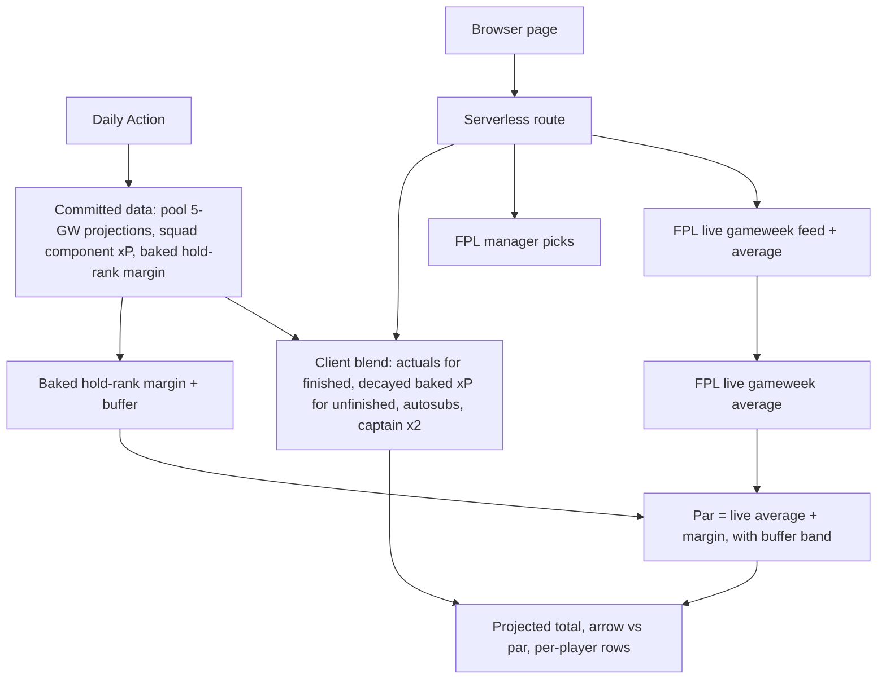
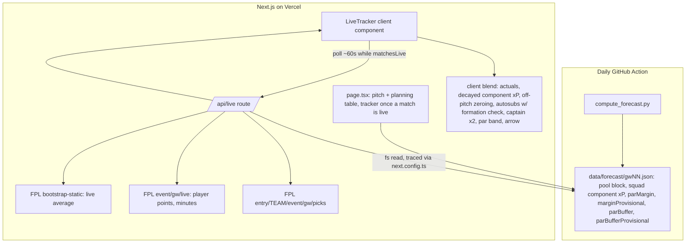

# Live Gameweek Tracker and Planning Table - Plan

## Goal Capsule

- **Objective:** Before a deadline and while a gameweek is being played, the manager gets from their own tool what they currently open fplgameweek.com for — a live read on where the gameweek is heading, and a pool-wide view of who is worth bringing in — without leaving the app.
- **Means:** A thin serverless route proxies FPL's live data; the browser blends it with the daily pipeline's baked projections; the pipeline widens its output to the whole player pool (KTD1, KTD3).
- **Product authority:** Single-user private tool. This plan owns the projections surface: a pre-deadline planning table and an in-gameweek live tracker. A "safety score" built as a floor/ceiling range or pick-consistency metric, mini-league / rival comparison, and push notifications are roadmap items, not active scope.
- **Open blockers:** None. Every Phase 1 fork is resolved as a Key Decision; the one remaining implementation-time unknown (KTD6) does not block start.
- **Execution profile:** Deep. Three surfaces move together — the Python forecast pipeline (widen the emitted projections), a new serverless route that proxies FPL live data, and the Next.js app (two new views). No live data path exists today.

---

## Product Contract

### Summary

Add one projections surface with two modes. Before the deadline, a table ranks the whole player pool by expected points over the next five gameweeks and marks pool players who out-project someone in the manager's squad. During matches, a tracker shows the projected final gameweek total, a "par" score (the total needed to hold overall rank, with a buffer), a green/red arrow, and a per-player breakdown, refreshed about once a minute through a serverless proxy to FPL's live data.

### Problem Frame

The manager keeps fplgameweek.com open before and during every gameweek for three things: a live rank read, a "safety" number, and a mid-gameweek projected total. Their own tool is strong for pre-deadline decisions but goes quiet once the deadline passes — it is a static site rebuilt once a day, with no live data. The moments the manager cares about most — watching a gameweek unfold, weighing a late transfer against the pool — still happen in another app. The cost is a split workflow and a tool that stops being useful exactly when engagement is highest.

### Requirements

**Live in-gameweek tracker**

- R1. During a gameweek the tracker shows a projected final gameweek total for the manager's team: for each starting player, the actual points when their match is finished, otherwise the pre-baked expected points for that gameweek. The captain's contribution counts twice.
- R2. A still-to-play player whose match is underway with no return has their remaining expected points reduced as minutes elapse.
- R3. The projected total applies FPL's autosub rule: a starter who finishes on zero minutes is replaced by the first eligible bench player, matching how FPL scores the gameweek.
- R4. The tracker shows a par score — the gameweek total that keeps the manager's overall rank from dropping — computed as the live gameweek average plus the manager's baked hold-rank margin (KTD2).
- R5. The par score carries a buffer band: the tracker reads green when the projected total is clear of par by more than the buffer, amber when within the buffer, red when below par. While the hold-rank margin is still provisional the buffer widens (KTD2).
- R6. The tracker shows one directional indicator — projected total versus par — as a green up arrow or red down arrow with the point gap. It shows no standalone live overall-rank number.
- R7. The tracker shows a row per squad player: opponent, match status (not started / in progress / finished / did not play), points so far, and the expected-points contribution still to come.
- R8. The tracker refreshes about once per minute while Premier League matches for the current gameweek are in progress, and stops outside match windows.

**Pre-deadline planning table**

- R9. The table lists every available player in the pool with expected points for each of the next five gameweeks and a total across them.
- R10. Each row also shows price, position, club, the next five opponents, selected-by percentage, and recent form.
- R11. The table is sortable by any column.
- R12. The table marks pool players who out-project a squad player at the same position over the five-gameweek horizon, showing the price difference for the swap and flagging it as over budget when it exceeds the manager's bank.
- R13. This upgrade marking replaces the current same-position, within-£0.3m alternatives shown per squad player; that narrower panel is removed. Per KD5.

**Data and freshness**

- R14. The forecast pipeline emits per-player five-gameweek expected points for the whole available pool, not only the manager's fifteen.
- R15. A serverless route fetches FPL's live gameweek data and the manager's current picks server-side and returns them to the page; the page never calls the FPL API directly.
- R16. The pre-baked expected points the tracker blends with live actuals come from the most recent pipeline run and are read from committed data, not recomputed per request.

### Key Decisions

- KD1. Real-time-ish through a polled serverless proxy. (session-settled: user-directed — chosen over a near-live pipeline that reruns every 15–20 minutes: the manager wants roughly one-minute freshness and accepts one continuously-hit function plus client polling.) Governs R8, R15.
- KD2. Par is distance-to-hold-rank with a buffer, not an expected floor and not a "bank a green arrow" target. (session-settled: user-directed — chosen over exact hold-rank and over a higher green-arrow bar: a clear not-dropping signal beats a coin-flip on the line.) Governs R4, R5.
- KD3. Par is read from FPL's published live score distribution at the manager's percentile, not from sampling the ~50 managers around their rank. (session-settled: user-directed — chosen over cohort sampling: the buffer tolerance makes sampling's ~50 fetches per refresh and its failure modes not worth it.) Governs R4.
- KD4. The tracker shows a par gap and arrow only, with no live overall-rank number. (session-settled: user-directed — chosen over an estimated rank number and over a last-known-rank-plus-drift display: the par gap already conveys direction and rough size.) Governs R6.
- KD5. The planning table is squad-aware and flags upgrades at any budget, not a browse-only reference. (session-settled: user-directed — chosen over a plain sortable reference and over shipping the reference first: the manager wants the "who do I bring in" judgement in the table itself.) Governs R12, R13.
- KD6. The tracker is a mid-gameweek instrument. Early in a gameweek the projected total and the live distribution are both too thin for par to mean much; the design does not try to make par informative at kickoff. Governs R4, R5.
- KD7. Autosubs are modelled in the projected total rather than showing the raw XI. Flagged in dialogue as an assumption the manager could have excluded; kept in. Governs R3.

### Key Flows

- F1. Live refresh during matches
  - **Trigger:** The page is open and at least one current-gameweek match is in progress.
  - **Steps:** The page requests live data from the serverless route about once a minute while a match is in progress. The route fetches FPL's live gameweek feed, the live gameweek average, and the manager's picks. The page blends finished-match actuals with decayed pre-baked expected points for unfinished players, applies autosubs, and sums with the captain doubled. The page computes par as the live gameweek average plus the baked hold-rank margin and applies the buffer band. The page renders the projected total, the band colour, the arrow and gap, and each player row.
  - **Covers R1, R2, R3, R4, R5, R6, R7, R8, R15, R16.**
  - **Outcome:** The manager sees where the gameweek is heading and whether they are holding rank, within about a minute of live events.
- F2. Pool comparison before the deadline
  - **Trigger:** The manager opens the planning table before a deadline.
  - **Steps:** The page loads the pipeline's pool-wide five-gameweek projections and renders every available player with the projection columns and metadata. The manager sorts by a column. For each squad position, the page marks pool players that out-project the held player over the horizon and shows the price delta and over-budget state.
  - **Covers R9, R10, R11, R12, R13, R14.**
  - **Outcome:** The manager weighs transfers against the whole pool without leaving the app.

### Acceptance Examples

- AE1. **Covers R1, R3.** Given the manager's XI where the goalkeeper's match finished on 6 points, a midfielder is playing on 2 points with about 3 still expected, and a defender played 0 minutes; when the tracker projects; then the goalkeeper contributes 6, the midfielder about 5, and the defender is replaced by the first bench player whose entry keeps the formation valid.
- AE2. **Covers R4, R5.** Given the live gameweek average is 41 and the manager's baked hold-rank margin is 6, so par is 47 and the buffer is 6; when the projected total is 58, the badge is green (11 > 6); when it is 50, the badge is amber (3 ≤ 6); when it is 44, the badge is red.
- AE3. **Covers R6.** Given the projected total is 58 and par is 47; then the tracker shows a green up arrow and "+11 vs par", and no overall-rank figure anywhere on the tracker.
- AE4. **Covers R4, R5, KD6.** Given no current-gameweek match has kicked off, or the hold-rank margin is still provisional; then par and the projected total are shown as low-confidence, the wider provisional buffer applies, and the badge does not assert green.
- AE5. **Covers R12.** Given the manager owns a £5.5m midfielder projected 18 over five gameweeks with £0.3m in the bank; when a £6.0m pool midfielder is projected 24; then the table marks it as an upgrade of +6 over the horizon and flags it over budget by £0.2m.
- AE6. **Covers R8.** Given the current gameweek's last match finished two hours ago; then the tracker has stopped polling and shows the final figures.
- AE7. **Covers R2, R3.** Given a starter is substituted off at minute 70 while their match continues, and a second starter is playing 0 minutes with their match finished; when the tracker projects; then the subbed-off starter contributes only points already scored with no remaining expected points, and the 0-minute starter is auto-subbed only if the resulting formation keeps at least three defenders and one forward.

### Success Criteria

- The manager stops opening fplgameweek.com before and during a gameweek — the table and tracker answer what they went there for.
- Mid-gameweek, the projected total and par gap read as trustworthy enough to act on a bench or captain regret check without cross-referencing another tool.

### Scope Boundaries

Deferred for later:

- A "safety" reading built as an expected floor/ceiling range or a pick-consistency score, separate from par.
- Mini-league / rival comparison: rivals' ranks, squads, captains, and differentials.
- Push notifications, such as "dropped below par" or "green arrow secured at full time".
- Cohort-sampled par (the roughly 50 managers around the manager's rank).
- An estimated or last-known live overall-rank number in the tracker.
- Extending the planning table horizon beyond the engine's five-gameweek window.
- A "transfer suggestions" or "other important players" panel inside the live tracker.

Outside this tool's identity:

- Multi-user access or sharing.

#### Deferred to Follow-Up Work

- A JavaScript test runner (for example vitest). The repo has none today, so U4, U5, U6, and U7 verify by type-check, lint, build, and a smoke check. U4 and U7 keep their blend logic in a pure module (`src/lib/liveBlend.ts`) so a later pass can unit-test it.
- Tighter Action cadence during match windows — not needed while the live route supplies freshness.
- Seeding the provisional hold-rank margin from a prior season's rank-percentile distribution instead of zero. Needs percentile-by-rank data the pipeline does not snapshot today.
- A calibration check in the Verification Contract comparing par against realised overall-rank movement once enough gameweeks are scored.
- Decay that reacts to game state beyond the clean-sheet carve-out (a red card, a blowout scoreline collapsing a striker's remaining xP).

### Dependencies / Assumptions

- The platform gains a second serverless route. The first, for saving transfers, calls the GitHub API; this one is polled about once a minute during match windows and proxies FPL's public live endpoints. It is the first request-time dependency on FPL data — until now all FPL data arrived through the daily Action.
- The manager's current picks are readable from FPL's public API mid-gameweek. fplgameweek reads them, so this is assumed to hold.
- The daily Action runs once at 03:00 UTC (`cron: "0 3 * * *"`) plus manual dispatch. The tracker's freshness comes from the serverless route, not a tighter Action schedule.
- The engine already computes five-gameweek totals for the whole pool in `engine/squad.py` (`window_points`); the per-gameweek breakdown and the per-component split are computed for the fifteen squad players only. R14 widens the emitted totals for the pool; U1 adds the per-gameweek and per-component detail for the fifteen.
- `bootstrap-static` `events[]` exposes `average_entry_score` for the current gameweek and it moves during play. The field name and its in-play refresh cadence are assumed from the public API's long-standing shape; execution confirms.

### Outstanding Questions

Resolve before planning:

- None.

Deferred to implementation:

- The per-component split of the still-to-play xP decay. KTD6 fixes the linear-by-minute shape for attacking value and ties clean-sheet value to the live scoreline; the exact appearance / attacking weights are tuned against real live data during execution (R2).

The other deferred-to-planning items — par source, route caching, match-window detection, where baked projections are read at request time, one page versus two routes, autosub formation logic, subbed-off detection, the responsive table, and loading and error states — are resolved in the Planning Contract and Implementation Units (KTD2, KTD5, KTD6, KTD7, U1, U4, U5, U7).

<!-- ce-section: work-relationships -->
### How This Work Fits Together

This plan owns the projections surface — the pre-deadline planning table and the in-gameweek live tracker. The manager's original request also named two other areas. The breakdown below is the current understanding, not a committed roadmap; a later plan may revise, split, or discard it.

- Safety score as a floor/ceiling or pick-consistency metric
  - `Can proceed independently of` this plan. `Shares` the model's per-player expected points. This plan's par score answers "am I safe this week" by a different route, which may make this redundant or reshape what it should be.
- Mini-league / rival comparison
  - `Can proceed independently of` this plan. `Depends on` a new ingest of other managers' public entries. `Enables` a cohort-sampled version of par (KD3's rejected alternative) if that ever becomes wanted.
- Push notifications
  - `Depends on` this plan's live compute existing. `Enables` the manager to skip opening the app during a gameweek at all.

---

## Planning Contract

**Product Contract preservation:** restructured, no scope change. R4 and AE2 now describe par as `live gameweek average + baked hold-rank margin` to match KTD2 — the percentile-hold intent and KD3's `session-settled` annotation are preserved; the change only aligns the requirement prose with the mechanism the plan settled on. R5 and AE4 gained a provisional-margin clause. AE7 was added for the subbed-off and formation-blocked autosub cases. `### Outstanding Questions` records which deferred items the plan resolves.

**Identifier scope:** the `U`, `R`, `KD`, and `KTD` identifiers in this document are local to it. `engine/` and `scripts/` already carry `U`, `R`, `KD`, and `KTD` annotations from the earlier decision-engine plan that mean different things (for example `KTD5` in `engine/config.py` is a config-consolidation decision, and `window_points` is annotated `U7`). Do not resolve this plan's identifiers against those.

### Key Technical Decisions

- KTD1. Thin `/api/live` route, blend on the client. The route returns near-raw FPL data plus the baked projection inputs; the browser computes the projected total, autosubs, par band, and arrow. The projection math already lives client-side for the pitch, so one place owns it. (session-settled: user-directed — instantiates the Product Contract's KD1 "real-time-ish via a serverless proxy", chosen over compute-in-function: the manager accepted a buffer on the safety band, which removes the reason to pay for server-side blending.) Governs R8, R15, R16.
- KTD2. Par anchors on `average_entry_score`, not a per-percentile curve. FPL publishes the live gameweek average in `bootstrap-static` `events[]`; it publishes no public per-percentile score distribution. Par = live average + the manager's baked hold-rank margin, where the margin is the median of `own gameweek points − that gameweek's average` over the manager's completed gameweeks this season (`data/history-<TEAM_ID>`). Below `PAR_MARGIN_MIN_GAMEWEEKS` completed gameweeks the margin is 0, `marginProvisional` is true, and the client applies `PAR_BUFFER_PROVISIONAL_POINTS` (a stated multiple of `PAR_BUFFER_POINTS`) so a top-decile manager is not told they are safe on the average alone. (session-settled: user-directed — instantiates KD3's percentile-hold intent, chosen over cohort sampling; KD3's stated source does not exist, so the margin derivation stands in for it.) Governs R4, R5.
- KTD3. Widen the forecast output, not the pool computation. `engine/squad.py` `window_points` already projects every pool player over `ROLLING_WINDOW`; `scripts/compute_forecast.py` serializes only the fifteen. Add a `pool` block to `data/forecast/gwNN.json` with per-gameweek and total xP plus display metadata for every `status == "a"` element, and add the per-component projection breakdown for the fifteen squad players' live gameweek so the tracker can decay attacking value on the clock. Governs R9, R10, R14.
- KTD4. Upgrade detection drops the price band. Replace the `PRICE_BAND_M` same-slot filter in the squad-versus-pool comparison with a same-position, any-price comparison over the five-gameweek total; surface the price delta and an over-budget flag from `entry_history.bank`. The narrow alternatives panel and its `top_alternatives` / `rank_against_pool` price-band path are retired; KTD8 owns when that removal lands. (session-settled: user-directed — instantiates KD5.) Governs R12.
- KTD5. The live route reads baked data from the filesystem and caches upstream fetches. `src/app/api/live/route.ts` reads `data/forecast/gwNN.json` and the baked par margin through the same committed `data/` tree that `src/lib/snapshots.ts` loaders use — no recompute, no GitHub round-trip. Because Next.js does not trace a computed path like `gw${n}.json` from a route handler, add an `outputFileTracingIncludes` entry for `/api/live` in `next.config.ts` covering `data/forecast/**`. Upstream FPL fetches use a revalidate of about 40 seconds (not `cache: "no-store"`), so client polling at about 60 seconds costs at most a few upstream calls per minute regardless of open tabs. The client derives the match window from each current-gameweek fixture's `kickoff_time` plus a fixed tail (kickoff to kickoff + 150 minutes); the route also returns a `matchesLive` boolean computed from the freshly fetched FPL data so the client stops polling promptly after the last final whistle. Governs R8, R16.
- KTD6. Still-to-play xP decays linearly by match minute. A starter's unrealized xP scales by `max(0, (90 − live_minute) / 90)` for the appearance and attacking components; the clean-sheet and goals-conceded components for goalkeepers and defenders are re-derived from the live scoreline, not the clock. This needs the per-component breakdown from KTD3; a scalar total would collapse the decay to uniform-linear. A starter substituted off (see U4's off-pitch detection) contributes only banked points, no remaining xP. The exact appearance-versus-attacking weight split is tuned during execution. Governs R2.
- KTD7. One page; the mode follows gameweek state. Before the deadline the page shows the planning table beside the existing pitch. Between the deadline and the first kickoff of the gameweek — a day or more after a Friday deadline — the table stays the primary surface. From the first match in progress until the gameweek is `data_checked` the page leads with the live tracker and keeps the table below. No manual toggle and no second route — this mirrors the existing auto-rolling target-gameweek pattern (`upcoming_gameweek`). Shapes F1, F2.
- KTD8. Remove the old alternatives surface producer and consumer together. `pool_upgrades` (U3) is added alongside the existing `alternatives` / `modelUpgrade` / `baselineUpgrade` fields; the `rank_against_pool` call, the `alternatives` assembly, `top_alternatives`, and the `PRICE_BAND_M` filter path are removed only in U6, in the same change that deletes the pitch panel, so no intermediate commit ships a forecast JSON missing fields the pitch still reads. Governs R13.

### High-Level Technical Design

Three surfaces. The daily Action writes committed data. The Next.js page is static except for the live tracker, which is a client component polling one dynamic route. The route reads committed data and proxies FPL; the client does the blend.

### Assumptions

- `entry/<TEAM_ID>/event/{gw}/picks/` is readable once the gameweek deadline passes. The daily pipeline already fetches it for finished gameweeks; mid-gameweek availability is assumed from third-party tools that read it.
- `bootstrap-static` `events[]` `average_entry_score` for the current event updates during the gameweek. Execution verifies the field name and refresh cadence against the live API.
- Vercel runs Next.js route handlers as serverless functions on this project — `src/app/api/transfers/route.ts` confirms it.
- The live route reads the team identifier from an `FPL_TEAM_ID` environment variable, matching `scripts/snapshot.py`; it does not reuse the id hardcoded in `src/lib/snapshots.ts`.
- FPL's live feed exposes enough per-player state (minutes, and whether the player is still on the pitch) to distinguish "did not play", "playing", "subbed off", and "finished". If a direct subbed-off signal is absent, U4 infers it from minutes frozen below the live match clock.

### Sequencing

- Phase A — data: U1 and U2 in parallel; no dependencies.
- Phase B — engine and route: U3 after U1; U4 after U1 and U2.
- Phase C — UI: U5 after U1 and U3; U7 after U4 and U2; U6 after U5 and U3 (U6 removes the old alternatives producer and consumer atomically, per KTD8).

### Sources / Research

- `src/app/api/transfers/route.ts` — the route-handler pattern for `/api/live`: env access, `NextResponse.json`, `try/catch` returning `{ error }` with a status. The live route uses a ~40s `revalidate` on its FPL fetches rather than this route's `cache: "no-store"`.
- `next.config.ts` — currently `{}`; `outputFileTracingIncludes` is the Next.js mechanism to force `data/forecast/**` into the `/api/live` serverless bundle.
- `scripts/snapshot.py` (`snapshot_event_live`, `snapshot_picks`) — precedent that `event/{gw}/live/` and `entry/<TEAM_ID>/event/{gw}/picks/` are public and fetchable server-side; also reads `FPL_TEAM_ID` from the environment.
- `engine/squad.py` — `window_points` (pool-wide totals, `ROLLING_WINDOW`), `rank_against_pool` and `top_alternatives` (position filter plus the `PRICE_BAND_M` filter KTD4/KTD8 remove), and `VALID_FORMATIONS` for the autosub formation check.
- `engine/features.py` — `team_fixtures` for building pool opponent legs from `ctx.fixtures` without extra model evaluations.
- `engine/model.py` — `ProjectionComponents` shape (appearance, goals, assists, cleanSheet, goalsConceded, saves, defensiveContribution, bonus, cards) for the per-component decay.
- `scripts/compute_forecast.py` `main` — builds the `forecast` dict; `pool_ids`, `feature_frame`, `model_window`, `_player_card`, the existing `upcoming` block to mirror for `pool`.
- `data/history-1168513/*.json` `current[]` (per-gameweek `points`, `overall_rank`) with `bootstrap-static` `events[]` `average_entry_score` — inputs for the baked par margin.
- FPL API: no public per-percentile live score-distribution endpoint; LiveFPL-class tools estimate rank themselves. `average_entry_score` is the available live field. Drives KTD2.
- `src/lib/snapshots.ts` — the committed-`data/` filesystem loader pattern reused by the live route and the planning table.

---

## Implementation Units

### U1. Emit pool-wide projections from the forecast pipeline

- **Goal:** `data/forecast/gwNN.json` carries a five-gameweek projection and display metadata for every available player, not only the manager's fifteen.
- **Requirements:** R9, R10, R14. KTD3.
- **Dependencies:** none.
- **Files:** `scripts/compute_forecast.py`, `engine/squad.py`, `tests/test_compute_forecast.py`, `tests/test_squad.py`.
- **Approach:**
  1. Extend `window_points` (or add a sibling) to return the per-gameweek values, not only the sum, for a given player set.
  2. In `compute_forecast.main`, build a `pool` list over `pool_ids`: `id`, five per-gameweek xP values, total, `price`, `elementType`, `team`, `webName`, `selectedByPercent` (bootstrap `selected_by_percent`), `form` (bootstrap `form`), and next-five opponent legs built from `ctx.fixtures` via `engine.features.team_fixtures` for the player's club — fixture lookups only, no `model.project_detail` per pool player.
  3. For the fifteen squad players only, also emit the per-gameweek `ProjectionComponents` breakdown for the live gameweek, so the tracker can decay attacking value on the clock and re-derive clean-sheet from the scoreline.
  4. Add `pool` and the squad component block to the emitted `forecast` dict.
- **Patterns to follow:** the existing `upcoming` block construction in `compute_forecast.main`; `_player_card` for identity fields; `team_fixtures` in `engine/features.py` for opponent legs.
- **Test scenarios:**
  - `pool` has one entry per `status == "a"` element; each has five per-gameweek values and a total equal to their sum.
  - A known player's five values match `model_fn(row, gw)` for those gameweeks.
  - A player with `status != "a"` is absent from `pool`.
  - `selectedByPercent` and `form` populate from bootstrap as numbers.
  - Pool opponent legs match `team_fixtures` for the player's club over the five target gameweeks; regenerating `gw3.json` does not measurably lengthen the Action step (no per-pool-player model call).
  - Each squad player's live-gameweek component breakdown has parts that sum to that gameweek's xP.
- **Verification:** regenerating `data/forecast/gw3.json` produces a `pool` array and a squad component block; `python -m pytest -q` green.

### U2. Bake the par margin into the forecast output

- **Goal:** the daily output carries the manager's hold-rank margin so the live route needs only one live call for par.
- **Requirements:** R4. KTD2.
- **Dependencies:** none.
- **Files:** `scripts/compute_forecast.py`, `engine/config.py`, `tests/test_compute_forecast.py`.
- **Approach:**
  1. Add `PAR_BUFFER_POINTS`, `PAR_BUFFER_PROVISIONAL_POINTS`, and `PAR_MARGIN_MIN_GAMEWEEKS` to `engine/config.py`. `PAR_BUFFER_PROVISIONAL_POINTS` is a stated multiple of `PAR_BUFFER_POINTS` (default 2x).
  2. For each completed gameweek in `data/history-<TEAM_ID>/…current[]`, compute `own_points − average_entry_score` for that gameweek; take the average from the `bootstrap-static` `events[]` snapshot.
  3. `parMargin` = median of those deltas. Below `PAR_MARGIN_MIN_GAMEWEEKS` completed gameweeks, `parMargin = 0` and `marginProvisional = true`.
  4. Emit `parMargin`, `marginProvisional`, `parBuffer`, and `parBufferProvisional` on the `forecast` dict.
- **Test scenarios:**
  - Three completed gameweeks with deltas +4, +10, +7 → `parMargin` 7, `marginProvisional` false.
  - One completed gameweek → `parMargin` 0, `marginProvisional` true.
  - A gameweek with no average in the bootstrap snapshot is skipped, not counted as delta 0.
  - `parBufferProvisional` equals `PAR_BUFFER_PROVISIONAL_POINTS` and is larger than `parBuffer`.
- **Verification:** `data/forecast/gw3.json` shows `parMargin`, `marginProvisional`, `parBuffer`, `parBufferProvisional`; `pytest` green.

### U3. Broaden squad-versus-pool upgrade detection

- **Goal:** for each squad player, the forecast marks every same-position pool player with a higher five-gameweek total, with the price delta and an over-budget flag, without a price band.
- **Requirements:** R12, R13. KTD4, KTD8.
- **Dependencies:** U1.
- **Files:** `engine/squad.py`, `scripts/compute_forecast.py`, `tests/test_squad.py`, `tests/test_compute_forecast.py`.
- **Approach:**
  1. Add `pool_upgrades(squad_ids, pool, bank)` in `engine/squad.py`: per squad player, keep same-position pool players with a higher five-gameweek total, sort by gap descending, return `{poolPlayerId, gap, priceDelta, overBudget}` where `overBudget = priceDelta > bank`.
  2. In `compute_forecast.main`, add the `pool_upgrades` output alongside the existing `alternatives` / `modelUpgrade` / `baselineUpgrade` fields. Do not remove the old fields, the `rank_against_pool` call, `top_alternatives`, or the `PRICE_BAND_M` filter here — U6 removes the producer and the pitch consumer together (KTD8).
- **Patterns to follow:** the `rank_against_pool` per-squad-player loop.
- **Test scenarios:**
  - Covers AE5. A £5.5m held midfielder projected 18 over five gameweeks, bank £0.3m; a £6.0m pool midfielder projected 24 → flagged, gap 6, `priceDelta` 0.5, `overBudget` true.
  - A cheaper pool player with a higher total is flagged with `overBudget` false.
  - Same-position only — a forward is never offered against a midfielder.
  - A squad player who leads his position in the pool returns no upgrades.
- **Verification:** forecast JSON carries the broadened upgrade data; `pytest` green.

### U4. `/api/live` serverless route

- **Goal:** one endpoint returns FPL live points, the manager's current picks, the live gameweek average, a match-window flag, and the baked projection inputs.
- **Requirements:** R15, R16, and the data half of R1–R8. KTD1, KTD5.
- **Dependencies:** U1, U2.
- **Files:** `src/app/api/live/route.ts` (new), `next.config.ts`, `src/lib/snapshots.ts`, `src/lib/liveBlend.ts` (new — pure payload-shaping helpers, shared with U7).
- **Approach:**
  1. `GET` handler. Read `TEAM_ID` from `process.env.FPL_TEAM_ID`. Fetch `bootstrap-static/`, `event/{gw}/live/`, `fixtures/?event={gw}`, and `entry/<TEAM_ID>/event/{gw}/picks/` from `https://fantasy.premierleague.com/api` with a ~40-second `revalidate` (not `cache: "no-store"`).
  2. Read `data/forecast/gwNN.json` from the committed tree via the `snapshots.ts` loader — the squad component xP, `parMargin`, `marginProvisional`, `parBuffer`, `parBufferProvisional`. Add `outputFileTracingIncludes: { "/api/live": ["./data/forecast/**"] }` to `next.config.ts` so the file is bundled into the function.
  3. Per element, derive status: `didNotPlay` (fixture finished, 0 minutes), `playing` (fixture in progress, on the pitch), `offPitch` (fixture in progress, minutes frozen below the live match clock — inferred subbed-off), `finished` (fixture finished). Return `{ liveByElement: { id: { points, minutes, status } }, picks: { starters, bench, captainId }, liveAverage, matchesLive, componentXpByElement, parMargin, marginProvisional, parBuffer, parBufferProvisional, generatedAt }`. `matchesLive` is true when any current-gameweek fixture has started and not finished.
  4. On any upstream failure or a missing committed forecast file, return `{ error }` with a 5xx status and a clear message, matching the transfers route.
- **Patterns to follow:** `src/app/api/transfers/route.ts` — handler signature, `try/catch` → `NextResponse.json({ error }, { status })`. `scripts/snapshot.py` for reading `FPL_TEAM_ID` from the environment.
- **Execution note:** no JS test runner in the repo — verify the scenarios below by hitting `/api/live` locally during a live gameweek and by a mocked-`fetch` walkthrough; keep the payload-shaping in `liveBlend.ts` pure for a later unit-test pass.
- **Test scenarios:**
  - Happy: with well-formed FPL responses the payload carries `liveByElement`, `picks`, `liveAverage`, `matchesLive`, `componentXpByElement`, and every baked field.
  - Happy: a player whose minutes are frozen below the live match clock in an in-progress fixture is `status: "offPitch"`; a 0-minute player in a finished fixture is `didNotPlay`.
  - Happy: `matchesLive` is false when every current-gameweek fixture is either not started or finished.
  - Error: an upstream 500 yields a 5xx `{ error }`, not a partial payload.
  - Error: a missing committed forecast file yields a 5xx `{ error }` with a clear message, not a crash.
- **Verification:** `npx tsc --noEmit`, `npm run lint`, `npm run build` pass; a `next build` then `npm start` run confirms `/api/live` resolves `data/forecast/*.json` inside the serverless function (not just that `npm run build` succeeds).

### U5. Planning table view

- **Goal:** a sortable table of the whole pool with five-gameweek xP, metadata, and squad-aware upgrade marks.
- **Requirements:** R9, R10, R11, R12.
- **Dependencies:** U1, U3.
- **Files:** `src/app/PlanningTable.tsx` (new), `src/lib/snapshots.ts` (a `PoolPlayer` type and `loadPool`), `src/app/page.tsx`.
- **Approach:**
  1. `loadPool` reads the `pool` block from the latest `data/forecast/gwNN.json`.
  2. `PlanningTable` renders a row per pool player: player, club, position, price, five per-gameweek xP, total, next five opponents, selected-by %, form.
  3. Mobile-first layout: one horizontally scrolling table with a sticky player + position column; name, price, and five-gameweek total always visible, the remaining columns reached by horizontal scroll. A sort-column selector control (touch-friendly) sets the sort column; a tap on a header toggles direction on pointer devices.
  4. Sort state is a small client island; default sort by five-gameweek total descending.
  5. A row that is an upgrade for a held player (U3 data) shows the mark, the price delta, and an over-budget tag when applicable.
  6. States: a loading skeleton while the pool loads; a "no pool data yet" empty state when the forecast has no `pool` block.
- **Patterns to follow:** the existing squad table in `src/app/`; `ProjectionCell` for xP; the current alternatives-chip styling for the upgrade mark.
- **Execution note:** no JS test runner in the repo — verify the scenarios below by rendering the table against `data/forecast/gw3.json` and headless screenshots at a phone width and a desktop width.
- **Test scenarios:**
  - Happy: every pool entry renders one row; the column count matches R10.
  - Happy: the sort-column selector plus a direction toggle reorders rows for price and for the five-gameweek total, ascending then descending.
  - Happy: at a phone width the player + position column stays pinned while the rest scroll horizontally; the page body does not scroll sideways.
  - Covers AE5. The over-budget upgrade case renders the mark and an "over budget by £0.2m" tag.
  - Edge: a player with no valid next fixture shows a blank-gameweek marker, not a crash.
  - Edge: a forecast with no `pool` block renders the empty state, not a crash.
- **Verification:** `npm run build` and `npx tsc --noEmit` pass; the table renders against `data/forecast/gw3.json` at both widths.

### U6. Remove the old alternatives surface, producer and consumer together

- **Goal:** the narrow "Transfer alternatives" panel and its data producer are gone in one change; the planning table is the single upgrade surface.
- **Requirements:** R13. KTD4, KTD8.
- **Dependencies:** U3, U5.
- **Files:** `src/app/Pitch.tsx`, `src/lib/snapshots.ts`, `src/app/page.tsx`, `scripts/compute_forecast.py`, `engine/squad.py`, `tests/test_squad.py`, `tests/test_compute_forecast.py`.
- **Approach:**
  1. Delete the alternatives panel JSX and its props from `Pitch.tsx`; drop the `alternatives` / `modelUpgrade` / `baselineUpgrade` / `AlternativeCard` wiring from `snapshots.ts` and the forecast type; remove dead imports.
  2. In `compute_forecast.main`, remove the `rank_against_pool` call and the `alternatives` / `modelUpgrade` / `baselineUpgrade` assembly, leaving `pool_upgrades` as the sole upgrade data.
  3. In `engine/squad.py`, remove `top_alternatives` and the `PRICE_BAND_M` filter path in `rank_against_pool` if no other caller remains; drop `PRICE_BAND_M` from `engine/config.py` when unused.
- **Execution note:** land as one change so no committed forecast JSON is missing fields the pitch still reads.
- **Test scenarios:**
  - Existing `test_squad.py` / `test_compute_forecast.py` cases that asserted the old `alternatives` shape are removed or repointed to `pool_upgrades`; `pytest` green.
  - `data/forecast/gw3.json` regenerated carries only `pool_upgrades`, no `alternatives` / `modelUpgrade`.
- **Verification:** `python -m pytest -q`, `npm run build`, `npm run lint`, `npx tsc --noEmit` pass; the panel no longer renders and the forecast JSON no longer carries the old fields.

### U7. Live tracker view

- **Goal:** during matches the page shows the projected final gameweek total, the par band and arrow, and a per-player breakdown, refreshing about once a minute.
- **Requirements:** R1, R2, R3, R4, R5, R6, R7, R8. KTD1, KTD6, KTD7.
- **Dependencies:** U2, U4.
- **Files:** `src/app/LiveTracker.tsx` (new client component), `src/lib/liveBlend.ts`, `src/lib/snapshots.ts` (types), `src/app/page.tsx` (mode switch by gameweek state).
- **Approach:**
  1. Poll `/api/live` about every 60 seconds while it reports `matchesLive: true`; the client also computes an expected window from each current-gameweek fixture's `kickoff_time` plus a 150-minute tail so it starts polling at kickoff without waiting for a snapshot refresh. Outside the window, render the last payload and stop.
  2. Projected total (`src/lib/liveBlend.ts`, pure): per starter — if `status` is `finished`, use actual points; if `didNotPlay`, use 0; if `offPitch`, use points already scored with no remaining xP; if `playing`, decay the baked component xP by `max(0, (90 − minute) / 90)` for appearance and attacking components and re-derive the clean-sheet and goals-conceded components from the live scoreline (KTD6). Double the captain.
  3. Autosubs (`liveBlend.ts`): for each `didNotPlay` starter, walk the bench in order and substitute in the first player whose entry keeps the formation valid — at least 3 defenders, at least 1 forward, a goalkeeper only for a goalkeeper — using `VALID_FORMATIONS` semantics from `engine/squad.py`. Use the substitute's projection.
  4. Par: `liveAverage + parMargin`; band green when `projected − par > parBuffer`, amber within the buffer, red below. When `marginProvisional`, use `parBufferProvisional` and treat the whole surface as low-confidence.
  5. Arrow: sign of `projected − par` with the point gap; no overall-rank number, per R6.
  6. Rows: per squad player — opponent, status (not started / playing / off / finished / did not play), points so far, remaining xP.
  7. UI states: an initial-load skeleton; on an `/api/live` failure mid-session, a "live data unavailable — last update HH:MM" banner that keeps retrying; a distinct low-confidence treatment before any match kicks off.
  8. Page composition per KTD7: table and pitch before the deadline and until the first match is in progress; the tracker leads from the first live match until the gameweek is `data_checked`.
- **Patterns to follow:** the client-component `fetch` pattern in `TransferForm`; `Pitch.tsx` for the per-player row layout; `VALID_FORMATIONS` in `engine/squad.py` for the formation rules.
- **Execution note:** no JS test runner in the repo — verify the scenarios below by driving `LiveTracker` with captured `/api/live` payloads; keep the blend math in `liveBlend.ts` pure for a later unit-test pass.
- **Test scenarios:**
  - Covers AE1. Goalkeeper finished on 6, midfielder playing on 2 with about 3 expected, defender on 0 minutes → goalkeeper 6, midfielder about 5, defender auto-subbed to the first formation-valid bench player.
  - Covers AE7. Two `didNotPlay` starters are both auto-subbed when the formation allows; a third is not subbed because it would drop below 3 defenders; a starter with `status: "offPitch"` contributes only banked points.
  - Covers AE2. Par 47 with buffer 6 → projected 58 green, 50 amber, 44 red.
  - Covers AE3. Projected 58, par 47 → green up arrow, "+11 vs par", no rank figure anywhere on the tracker.
  - Covers AE4. No current-gameweek fixture started, or `marginProvisional` true → projected total and par low-confidence, `parBufferProvisional` applied, badge not green.
  - Covers AE6. `matchesLive` goes false after the last match → polling stopped, final figures shown.
  - Error: an `/api/live` failure mid-gameweek shows the "live data unavailable" banner and keeps retrying; the last good figures stay on screen.
  - Edge: a `playing` starter at minute 60 with no return has remaining attacking xP about one third of the baked value.
- **Verification:** `npm run build` and `npx tsc --noEmit` pass; the tracker matches AE1–AE7 against captured payloads.

---

## Verification Contract

| Gate | Command | Applies to |
|---|---|---|
| Python unit tests | `python -m pytest -q` | U1, U2, U3, U6 |
| Type check | `npx tsc --noEmit` | U4, U5, U6, U7 |
| Lint | `npm run lint` | U4, U5, U6, U7 |
| Production build | `npm run build` | U4, U5, U6, U7 |
| Live route production read | `next build` then `npm start`; hit `/api/live` and confirm `data/forecast/*.json` resolves inside the function (5xx on a real production run means the file was not traced) | U4 |
| Live route smoke | hit `/api/live` during a live gameweek; confirm the payload shape, `matchesLive`, and a 5xx `{ error }` on upstream failure | U4 |
| Table responsiveness | headless screenshots at a phone width and a desktop width; identity column pinned, no sideways body scroll | U5 |
| Tracker acceptance | drive `LiveTracker` with captured `/api/live` payloads; confirm AE1–AE7 and the mid-gameweek failure banner | U7 |

No JavaScript test runner exists in the repo; U4–U7 rely on the type-check, lint, build, production-read, and smoke gates above. Adding a runner is in Deferred to Follow-Up Work.

---

## Definition of Done

Global:

- Every requirement R1–R16 is met and traced to at least one unit.
- `python -m pytest -q`, `npx tsc --noEmit`, `npm run lint`, and `npm run build` all pass.
- `data/forecast/gw3.json` regenerated and committed with the `pool` block, the squad component xP block, `parMargin`, `marginProvisional`, `parBuffer`, and `parBufferProvisional`.
- The `/api/live` production-read gate and smoke pass, and the AE1–AE7 tracker checks pass.
- The old "Transfer alternatives" panel, its data producer, and dead wiring are removed, not left in the diff.
- No abandoned or experimental code from approaches that did not pan out remains.

Per unit:

- U1: pool projections and squad component xP in the forecast JSON; pool opponent legs come from fixtures with no per-pool-player model call; pool tests green.
- U2: par margin and provisional-buffer fields in the forecast JSON; margin tests green.
- U3: `pool_upgrades` data added alongside the existing alternatives fields; squad tests green including the over-budget case.
- U4: `/api/live` returns the documented payload including `matchesLive` and `componentXpByElement`; the file resolves in a production run; upstream failure returns a 5xx `{ error }`.
- U5: the planning table renders every pool row, sorts via the selector, pins the identity column on a phone width, and marks upgrades with price deltas.
- U6: the alternatives panel and its producer are gone in one change; pytest, build, lint, and type-check are clean.
- U7: the tracker shows the projected total, par band, and arrow; auto-subs respect formation validity; a subbed-off starter keeps no remaining xP; polling follows `matchesLive`; a mid-gameweek failure shows the stale-data banner; matches AE1–AE7.
